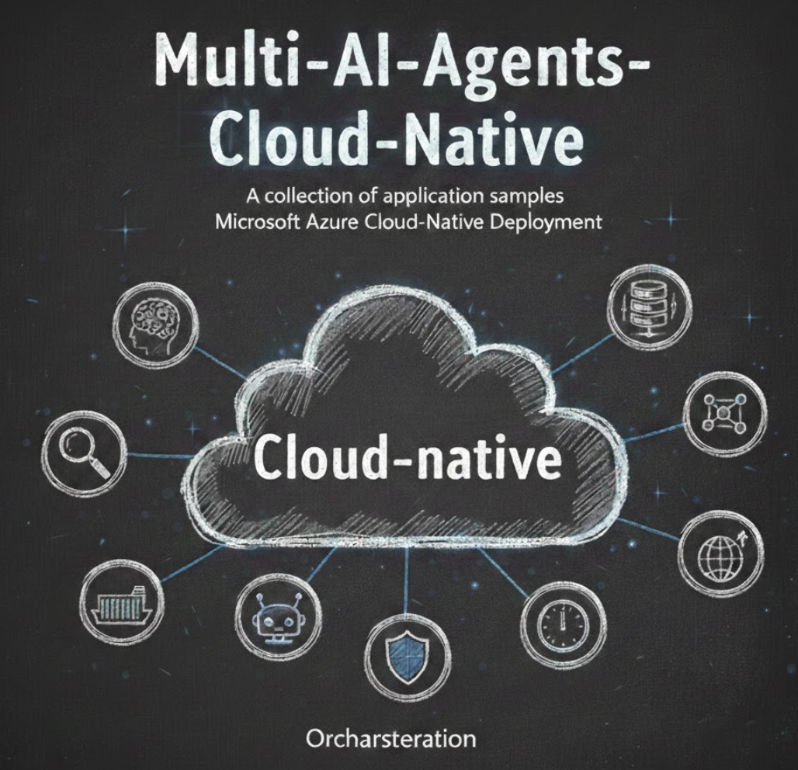

# Multi-AI-Agents-Cloud-Native



A collection of **multi-agent AI application samples** designed for **cloud-native deployment** on **Microsoft Azure**. This repository demonstrates how to build, orchestrate, and deploy intelligent AI agent systems using modern cloud technologies.

## Overview

Multi-agent systems represent the next evolution in AI applications, where specialized agents collaborate to solve complex tasks. This repository provides practical examples of building such systems with:

### Communication Protocols

- **Agent-to-Agent (A2A) Protocol** - Inter-agent communication using JSON-RPC 2.0 and SSE streaming
- **Model Context Protocol (MCP)** - Standardized protocol for connecting AI models to external data sources and tools
- **Agent Communication Protocol (ACP)** - Event-driven protocol for asynchronous agent messaging, supporting pub/sub patterns and complex multi-agent workflows

### AI Frameworks & SDKs

- **GitHub Copilot SDK** - AI-powered capabilities for content generation and code assistance
- **Microsoft Agent Framework** - Framework for building and orchestrating AI agents
- **Microsoft Foundry** - Enterprise-grade AI platform for building, deploying, and managing AI applications at scale

### Cloud-Native Deployment on Microsoft Azure

- **Azure Container Apps** - Serverless container platform for deploying microservices and AI agents with automatic scaling, built-in load balancing, and simplified operations
- **Azure Kubernetes Service (AKS)** - Fully managed Kubernetes for complex multi-agent deployments requiring fine-grained control, custom networking, and enterprise-grade orchestration
- **Azure Container Registry** - Private Docker registry for storing and managing container images

## Repository Structure

```
Multi-AI-Agents-Cloud-Native/
├── README.md
└── code/
    └── GitHubCopilotAgents_A2A/    # A2A Protocol Multi-Agent Example
```

---

## Examples

### 1. GitHub Copilot Agents with A2A Protocol

📁 **Location**: [`code/GitHubCopilotAgents_A2A/`](./code/GitHubCopilotAgents_A2A/)

A comprehensive multi-agent orchestration system leveraging the **A2A Protocol** and **GitHub Copilot SDK**.

#### Key Features

| Feature | Description |
|---------|-------------|
| **Blog Agent** | Generates technical blog posts with DeepSearch integration |
| **PPT Agent** | Creates professional presentations with code examples |
| **Orchestrator** | Intelligently routes tasks using Microsoft Agent Framework |
| **A2A Protocol** | Full JSON-RPC 2.0 + SSE streaming compliance |

#### Architecture Highlights

- **Multi-Agent Orchestration**: Intelligent task routing based on agent capabilities and keywords
- **Real-time Streaming**: Server-Sent Events (SSE) for long-running task responses
- **Cloud-Native Deployment**: Containerized agents deployable to Azure Container Apps
- **Secure Configuration**: Environment-based secret management

#### Technologies Used

- Python 3.12+ with FastAPI
- GitHub Copilot SDK
- Microsoft Agent Framework
- Azure Container Apps & Azure Container Registry
- Docker containerization

#### Quick Start

```bash
cd code/GitHubCopilotAgents_A2A

# Start Blog Agent
cd gh-copilot-multi-agents/gh-cli-blog-agent
pip install -r requirements.txt
python main.py

# Start PPT Agent (new terminal)
cd gh-copilot-multi-agents/gh-cli-ppt-agent
pip install -r requirements.txt
python main.py

# Start Orchestrator (new terminal)
cd multi-agents-orchestrations/gh-copilot-a2a-orchestration
python main.py
```

👉 [View Full Documentation](./code/GitHubCopilotAgents_A2A/README.md)

---

## Prerequisites

Before running any example, ensure you have:

- **Python**: 3.12 or higher
- **Node.js**: 20 or higher
- **Docker**: For containerized deployment
- **Azure CLI**: For Azure deployments
- **Git**: For version control

## Azure Services Used

| Service | Purpose |
|---------|---------|
| **Azure Container Apps** | Serverless container hosting for agents |
| **Azure Container Registry** | Private Docker image storage |
| **Azure Resource Groups** | Resource organization and management |

## Related Resources

### Documentation

- [A2A Protocol Specification](https://a2a-protocol.org/latest/)
- [GitHub Copilot SDK](https://github.com/github/copilot-sdk)
- [Microsoft Agent Framework](https://github.com/microsoft/agent-framework)
- [Azure Container Apps Documentation](https://learn.microsoft.com/en-us/azure/container-apps/)

### Tutorials

- [FastAPI Documentation](https://fastapi.tiangolo.com/)
- [Docker Getting Started](https://docs.docker.com/get-started/)

---

## Contributing

Contributions are welcome! If you have a multi-agent example to add:

1. Create a new folder under `code/`
2. Include a comprehensive `README.md` with architecture, setup, and usage instructions
3. Provide deployment scripts for Azure
4. Submit a pull request

## License

This project is open source and available under the [MIT License](LICENSE).

## Author

**Kinfey Lo** - [GitHub](https://github.com/kinfey)

---

> 💡 **Tip**: Star this repository to stay updated with new multi-agent examples!
