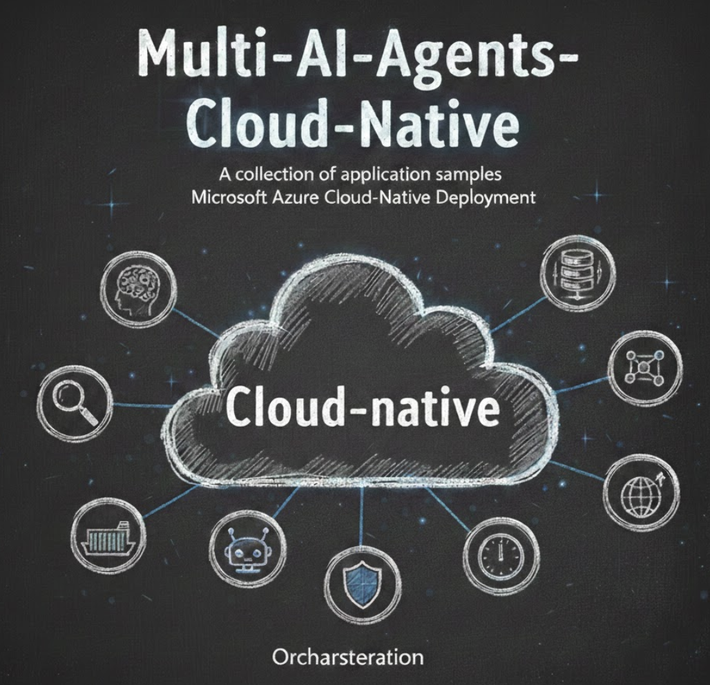

# Multi-AI-Agents-Cloud-Native



A collection of **multi-agent AI application samples** designed for **cloud-native deployment** on **Microsoft Azure**. This repository demonstrates how to build, orchestrate, and deploy intelligent AI agent systems using modern cloud technologies.

## Overview

Multi-agent systems represent the next evolution in AI applications, where specialized agents collaborate to solve complex tasks. This repository provides practical examples of building such systems with:

### Communication Protocols

- **Agent-to-Agent (A2A) Protocol** - Inter-agent communication using JSON-RPC 2.0 and SSE streaming
- **Model Context Protocol (MCP)** - Standardized protocol for connecting AI models to external data sources and tools
- **Agent Communication Protocol (ACP)** - Event-driven protocol for asynchronous agent messaging, supporting pub/sub patterns and complex multi-agent workflows

### AI Frameworks & SDKs

- **GitHub Copilot SDK** - Multi-platform SDK (Python, TypeScript, Go, .NET) for embedding Copilot's agentic workflows into applications. Exposes the same production-tested agent runtime behind Copilot CLI—you define agent behavior, Copilot handles planning, tool invocation, file edits, and more
- **Microsoft Agent Framework** - Framework for building and orchestrating AI agents
- **Microsoft Foundry** - Enterprise-grade AI platform for building, deploying, and managing AI applications at scale
- **AI Runway with KAITO** - Kubernetes-native model serving for OpenAI-compatible inference endpoints, including CPU-friendly local LLM deployment patterns

### Security & Hardening

- **5-Layer Defense Architecture** - Comprehensive container security with secrets rotation, DNS auditing, seccomp profiles, egress monitoring, and tool allowlisting
- **OpenClaw Gateway** - AI agent gateway with token-based authentication, tool sandboxing, and configurable agent orchestration
- **Kata microVM Isolation** - AKS pod sandboxing that gives each agent pod its own lightweight VM boundary and isolated guest kernel
- **Hyperlight Wasm Sandbox** - Per-call snapshot-restored Wasm microVMs for safely running LLM-generated code with a single `execute_code` tool surface and host-mediated `call_tool` bridges

### Cloud-Native Deployment on Microsoft Azure

- **Azure Container Apps** - Serverless container platform for deploying microservices and AI agents with automatic scaling, built-in load balancing, and simplified operations
- **Azure Kubernetes Service (AKS)** - Fully managed Kubernetes for complex multi-agent deployments requiring fine-grained control, custom networking, and enterprise-grade orchestration
- **Azure Container Registry** - Private Docker registry for storing and managing container images
- **Azure API Management (APIM)** - Full-lifecycle API management for publishing, securing, and monitoring AI agent APIs with built-in rate limiting, authentication, and analytics

## Repository Structure

```
Multi-AI-Agents-Cloud-Native/
├── README.md
└── code/
    ├── AKS_MicroVM/                # Copilot SDK Agent on AKS with Kata microVM Isolation
    ├── BYOT_Dev/                   # Bring Your Own Tower of Agents with AI Runway + MCP
    ├── GitHubCopilotAgents_A2A/    # A2A Protocol Multi-Agent Example
    ├── GitHubCopilotSideCar/       # Kubernetes Sidecar Pattern Example
    ├── harnessagent_sandbox_demo/  # Harness Agents on Hyperlight Wasm Sandbox (FIFA 2026 podcast pipeline)
    └── openclaw_security/          # Security-Hardened AI Podcast Generator
```

---

## Examples

### 1. GitHub Copilot Agents with A2A Protocol

📁 **Location**: [`code/GitHubCopilotAgents_A2A/`](./code/GitHubCopilotAgents_A2A/)

A comprehensive multi-agent orchestration system leveraging the **A2A Protocol** and **GitHub Copilot SDK**.

#### Key Features

| Feature | Description |
|---------|-------------|
| **Blog Agent** | Generates technical blog posts with DeepSearch integration |
| **PPT Agent** | Creates professional presentations with code examples |
| **Orchestrator** | Intelligently routes tasks using Microsoft Agent Framework |
| **A2A Protocol** | Full JSON-RPC 2.0 + SSE streaming compliance |

#### Architecture Highlights

- **Multi-Agent Orchestration**: Intelligent task routing based on agent capabilities and keywords
- **Real-time Streaming**: Server-Sent Events (SSE) for long-running task responses
- **Cloud-Native Deployment**: Containerized agents deployable to Azure Container Apps
- **Secure Configuration**: Environment-based secret management

#### Technologies Used

- Python 3.12+ with FastAPI
- GitHub Copilot SDK
- Microsoft Agent Framework
- Azure Container Apps & Azure Container Registry
- Docker containerization

#### Quick Start

```bash
cd code/GitHubCopilotAgents_A2A

# Start Blog Agent
cd gh-copilot-multi-agents/gh-cli-blog-agent
pip install -r requirements.txt
python main.py

# Start PPT Agent (new terminal)
cd gh-copilot-multi-agents/gh-cli-ppt-agent
pip install -r requirements.txt
python main.py

# Start Orchestrator (new terminal)
cd multi-agents-orchestrations/gh-copilot-a2a-orchestration
python main.py
```

👉 [View Full Documentation](./code/GitHubCopilotAgents_A2A/README.md)

---

### 2. GitHub Copilot Agent with Kubernetes Sidecar Pattern

📁 **Location**: [`code/GitHubCopilotSideCar/`](./code/GitHubCopilotSideCar/)

A Kubernetes-native AI blog generation agent using the **Dual-Sidecar Pattern**, deploying three containers within a single Pod for separation of concerns and shared-volume collaboration.

#### Architecture

| Container | Role | Port |
|-----------|------|------|
| **blog-app** (Main) | Nginx web viewer + reverse proxy | 80 |
| **copilot-agent** (Sidecar 1) | FastAPI + GitHub Copilot SDK for AI blog generation | 8001 |
| **skill-server** (Sidecar 2) | FastAPI skill management, serves SKILL.md via ConfigMap | 8002 |

#### Key Features

| Feature | Description |
|---------|-------------|
| **Dual-Sidecar Pattern** | Three containers in one Pod — main app, AI agent, and skill server |
| **Shared Volume Collaboration** | `emptyDir` volumes for blog data and skill sharing between containers |
| **ConfigMap-Driven Skills** | Agent behavior defined in Kubernetes ConfigMap, hot-reloadable without rebuild |
| **GitHub Copilot SDK** | AI-powered blog generation with DeepSearch integration |
| **Reverse Proxy** | Nginx routes `/agent/` and `/skill/` to sidecars via localhost |

#### Data Flow

```
ConfigMap (SKILL.md) → Skill Server syncs to shared volume
    → Copilot Agent reads skills & generates blog
    → Writes to shared volume → Nginx serves content
```

#### Technologies Used

- Python 3.12+ with FastAPI
- GitHub Copilot SDK + Node.js 20
- Kubernetes (kind for local development)
- Nginx reverse proxy
- Docker multi-container Pod

#### Quick Start

```bash
cd code/GitHubCopilotSideCar/code/gh-cli-blog-agent

# One-click: create cluster, build images, deploy
make up

# Set your GitHub Copilot token
make set-token TOKEN=<your-github-copilot-token>

# Port-forward to access the app
make port-forward

# Generate a blog post
curl -X POST http://localhost:8080/agent/task \
  -H "Content-Type: application/json" \
  -d '{"topic": "Kubernetes Sidecar Pattern"}'

# View generated blogs
curl http://localhost:8080/blog/
```

👉 [View Full Documentation](./code/GitHubCopilotSideCar/code/README.md)

---

### 3. Security-Hardened AI Podcast Generator with OpenClaw

📁 **Location**: [`code/openclaw_security/`](./code/openclaw_security/)

A fully automated AI podcast generation pipeline with a **5-layer security-hardened** Docker Compose architecture. Combines **OpenClaw Gateway** for AI agent orchestration, **SerpAPI DeepSearch** for real-time trend scouting, and **Ollama** for local LLM dialogue generation — all running inside hardened containers with defense-in-depth security controls.

#### Architecture

| Container | Role | Security Layer |
|-----------|------|----------------|
| **secrets-init** | Token rotation on startup, tmpfs secrets volume, inotifywait audit | Layer 0 |
| **dns-audit** | Unbound DNS sidecar, all queries logged, Cloudflare DoT upstream | Layer 1 |
| **openclaw** | AI agent gateway with seccomp profile, cap_drop ALL, tool allowlist | Layers 2–5 |
| **ollama** | Local LLM inference (Qwen3-0.6B) | Inherited security |
| **podcast-app** | Automated pipeline: trend scout → deep search → podcast generation | Inherited security |

#### Key Features

| Feature | Description |
|---------|-------------|
| **5-Layer Defense** | Secrets rotation, DNS audit, seccomp profiles, nftables egress logging, tool allowlisting |
| **Automated Pipeline** | End-to-end: trend scouting → web research → LLM dialogue generation → TXT output |
| **OpenClaw TrendScout** | AI agent uses `web_search` tools to discover trending AI/tech topics in real time |
| **SerpAPI DeepSearch** | Google Search + page scraping + LLM summarization for deep knowledge building |
| **Local LLM Inference** | Ollama with Qwen3-0.6B for private, cost-free podcast script generation |
| **Boot Token Rotation** | Gateway token regenerated on every container startup via `secrets-init` |
| **DNS Query Auditing** | All DNS resolutions logged through Unbound sidecar for full visibility |
| **seccomp Hardening** | Custom profile allows AF_NETLINK (Node.js requirement) while blocking CLONE_NEWUSER namespace escapes |

#### Security Architecture

```
┌─────────────────────────────────────────────────────────────┐
│  Host (nftables egress logging, IMDS blocked)               │
│                                                             │
│  ┌──────────────┐  ┌──────────────┐  ┌──────────────────┐  │
│  │ secrets-init │  │  dns-audit   │  │     openclaw     │  │
│  │ (Layer 0)    │  │  (Layer 1)   │  │   (Layers 2-5)   │  │
│  │ boot rotate  │  │ Unbound DNS  │  │ seccomp profile  │  │
│  │ inotifywait  │  │ log-queries  │  │ cap_drop ALL     │  │
│  │ audit log    │  │ Cloudflare   │  │ tool allowlist   │  │
│  │              │  │ DoT upstream │  │ exec disabled    │  │
│  └──────┬───────┘  └──────┬───────┘  └────────┬─────────┘  │
│         │ secrets-vol     │ :53               │            │
│         └─────────────────┴───────────────────┘            │
│                    podcast-net (172.20.0.0/24)              │
└─────────────────────────────────────────────────────────────┘
```

#### Data Flow

```
secrets-init (rotates token) → OpenClaw Gateway (authenticates)
    → TrendScout Agent (web_search via SerpAPI) → discovers trending topics
    → DeepSearch (scrapes & summarizes sources) → builds knowledge base
    → Ollama LLM (generates podcast dialogue) → TXT output
```

#### Technologies Used

- Python 3.11 with automated orchestration pipeline
- OpenClaw Gateway for AI agent management
- Ollama with Qwen3-0.6B for local LLM inference
- SerpAPI for real-time web search
- Docker Compose with multi-container security architecture
- Unbound DNS for query auditing
- Custom seccomp profiles for syscall filtering

#### Quick Start

```bash
cd code/openclaw_security/code

# Configure your SerpAPI key
cp .env.example .env
vim .env  # fill in SERPAPI_KEY

# One-command setup & launch
chmod +x setup.sh && ./setup.sh
docker compose run --rm podcast-app
```

#### Monitoring

```bash
# DNS query audit (all domains resolved by OpenClaw)
docker logs -f dns-audit

# Secrets directory access audit
docker logs -f secrets-init

# Host-level egress connection logging
sudo bash security/egress-monitor.sh setup
sudo bash security/egress-monitor.sh watch
```

👉 [View Full Documentation](./code/openclaw_security/README.md)

---

### 4. GitHub Copilot SDK Agent on AKS with Kata microVM Isolation

📁 **Location**: [`code/AKS_MicroVM/`](./code/AKS_MicroVM/)

A hardened **GitHub Copilot SDK Agent** service running on **Azure Kubernetes Service (AKS)** with **Kata Containers microVM isolation** (`kata-vm-isolation`). Each pod runs inside an isolated Microsoft Hyper-V (mshv) lightweight VM with its own guest kernel, drastically reducing the blast radius of container escape when the Agent executes untrusted, model-generated code (shell, file I/O, MCP servers, `npx` packages).

#### Architecture

| Layer | Protection |
|-------|------------|
| **Pod sandbox** | `runtimeClassName: kata-vm-isolation` → microVM + isolated guest kernel |
| **Container** | `runAsNonRoot`, `readOnlyRootFilesystem`, drop ALL caps, `seccompProfile: RuntimeDefault` |
| **Network** | `NetworkPolicy` restricts egress to required Copilot / GitHub / MCP endpoints |
| **Secrets** | `GH_TOKEN` via Kubernetes Secret (swappable with CSI + Azure Key Vault) |
| **Agent tools** | `on_permission_request` deny-by-default with explicit allowlist |

#### Key Features

| Feature | Description |
|---------|-------------|
| **Kata microVM Isolation** | Each pod runs in its own Hyper-V lightweight VM with a dedicated guest kernel |
| **Microsoft Agent Framework + Copilot SDK** | FastAPI service wrapping `GitHubCopilotAgent` with sync and streaming endpoints |
| **Untrusted Code Containment** | Safe to run Copilot CLI, MCP servers, and arbitrary `npx` packages |
| **NetworkPolicy Egress Control** | Only required outbound destinations allowed |
| **Defense-in-Depth Pod Security** | Non-root, read-only root FS, dropped caps, seccomp RuntimeDefault |
| **AKS Pod Sandboxing** | Uses AKS-native `kata-vm-isolation` RuntimeClass on Azure Linux nodes |

#### Technologies Used

- Python 3.12 + FastAPI + uvicorn
- GitHub Copilot SDK + Copilot CLI (Node.js 20)
- Microsoft Agent Framework
- Azure Kubernetes Service (AKS) with Pod Sandboxing (Kata Containers)
- Azure Linux node pool + nested-virtualization-capable VM SKU (e.g. `Standard_D4s_v3`)
- Azure Container Registry

#### Quick Start

```bash
cd code/AKS_MicroVM

# 1. Create AKS with Kata (KataVmIsolation) enabled
bash infra/01-create-aks.sh

# 2. Verify the RuntimeClass is present
kubectl get runtimeclass kata-vm-isolation

# 3. Build and push the image to ACR
bash infra/02-build-push.sh

# 4. Create the Secret with your GitHub Copilot token
cp k8s/secret.example.yaml k8s/secret.yaml
# edit k8s/secret.yaml and set GH_TOKEN / GITHUB_TOKEN

# 5. Deploy manifests
bash infra/03-deploy.sh

# 6. Call the agent via API server proxy (port-forward does NOT work for Kata pods)
kubectl proxy --port=8001 &
curl -s -X POST \
  http://localhost:8001/api/v1/namespaces/copilot-agent/services/copilot-agent:80/proxy/chat \
  -H 'content-type: application/json' \
  -d '{"message":"Briefly introduce Kata Containers."}'
```

> ⚠️ **Kata caveat**: `kubectl port-forward` does not work against Kata pods because the listener lives inside the microVM, not in the sandbox netns. Use the API server proxy, an in-cluster client, or expose the Service via Ingress / LoadBalancer.

👉 [View Full Documentation](./code/AKS_MicroVM/README.md)

---

### 5. BYOT - Bring Your Own Tower of Agents on AKS

📁 **Location**: [`code/BYOT_Dev/`](./code/BYOT_Dev/)

An end-to-end reference build that runs a four-agent SDLC tower on **AKS**, with **AI Runway** serving `Qwen/Qwen3-0.6B` through an OpenAI-compatible API and each agent exposed as a remote **MCP server** for GitHub Copilot Chat.

#### Agent Tower

| Agent | Role | Example MCP Tools |
|-------|------|-------------------|
| **Requirements Agent** | Turns product ideas into structured requirements | `gather_requirements`, `clarify_requirement`, `produce_requirements_doc` |
| **Code Agent** | Generates, refactors, and reviews implementation code | `implement_from_requirements`, `write_module`, `refactor_code`, `review_code` |
| **Test Agent** | Produces test plans, test cases, and coverage guidance | `generate_test_plan`, `generate_test_cases`, `review_coverage` |
| **Deploy Agent** | Creates deployment artifacts for containerized workloads | `generate_dockerfile`, `generate_k8s_manifest`, `produce_deploy_plan` |

#### Architecture Highlights

- **AI Runway Model Serving**: KAITO + llama.cpp hosts `Qwen/Qwen3-0.6B` as an OpenAI-compatible Chat Completions endpoint
- **Microsoft Agent Framework Runtime**: Each MCP tool wraps the AI Runway endpoint through `OpenAIChatCompletionClient`
- **Kata-Isolated Agents**: Every agent Deployment uses `runtimeClassName: kata-vm-isolation`, non-root execution, read-only root filesystem, dropped Linux capabilities, and seccomp RuntimeDefault
- **One Agent per Node**: Pod anti-affinity keeps the four BYOT agents on distinct AKS nodes for stronger workload separation
- **Copilot Chat Validation**: `.vscode/mcp.json` registers the four public Azure LoadBalancer MCP endpoints for use directly inside VS Code
- **NetworkPolicy Egress Control**: Agent traffic is constrained to DNS and the AI Runway model namespace

#### Data Flow

```
VS Code + GitHub Copilot Chat
  -> MCP over Streamable HTTP
  -> Azure LoadBalancer per agent
  -> Kata microVM-isolated FastMCP agent
  -> Microsoft Agent Framework
  -> AI Runway OpenAI-compatible endpoint
  -> Qwen/Qwen3-0.6B on KAITO / llama.cpp
```

#### Technologies Used

- Python 3.12 with Starlette and FastMCP
- Microsoft Agent Framework with OpenAI-compatible chat completion client
- AI Runway controller with KAITO provider and llama.cpp engine
- Azure Kubernetes Service with KataVmIsolation and Azure Linux nodes
- Azure Container Registry and Azure LoadBalancer Services
- GitHub Copilot Chat remote MCP server configuration

#### Quick Start

```bash
cd code/BYOT_Dev

# 1. Provision AKS with Kata + ACR + Azure Linux
bash infra/01-create-aks-kata.sh

# 2. Install AI Runway controller and KAITO provider
bash infra/02-install-airunway.sh

# 3. Deploy Qwen/Qwen3-0.6B on CPU
bash infra/03-deploy-qwen.sh
kubectl -n airunway-models wait --for=condition=Ready modeldeployment/llama3-2-1b-cpu --timeout=20m

# 4. Build and push the shared agent image
bash infra/04-build-push-agents.sh

# 5. Deploy the four Kata-isolated MCP agents
bash infra/05-deploy-agents.sh

# 6. Print the public MCP endpoints for GitHub Copilot Chat
bash infra/06-show-mcp-endpoints.sh
```

After deployment, update the bundled [`code/BYOT_Dev/.vscode/mcp.json`](./code/BYOT_Dev/.vscode/mcp.json) with the LoadBalancer IPs printed by step 6. In Copilot Chat agent mode, you can ask: *"Use the byot tower to take this idea - a URL shortener with click analytics - from requirements through deployment."*

👉 [View Full Documentation](./code/BYOT_Dev/README.md)

---

### 6. Harness Agents on Hyperlight Wasm Sandbox

📁 **Location**: [`code/harnessagent_sandbox_demo/`](./code/harnessagent_sandbox_demo/)

A local, **graph-orchestrated multi-agent workflow** that produces a daily Mandarin podcast script about the **FIFA World Cup 2026**. Three LLM agents built with **Microsoft Agent Framework**'s `create_harness_agent` + `FoundryChatClient` are wired into a `WorkflowBuilder` graph, and every piece of LLM-generated code runs inside a single **Hyperlight Wasm sandbox** with per-call snapshot restore.

#### Workflow Graph

| Node | Kind | Tools visible to model | Responsibility |
|------|------|------------------------|----------------|
| `prepare_search_prompt` | adapter | — | Build the SearchAgent prompt from the target date |
| **SearchAgent** | harness agent (CodeAct) | `execute_code` (+ guest `call_tool("fetch_url", ...)`) | Fetch the BBC World Cup listing, verify article URLs, return top 5 stories as JSON |
| **ContentAgent** | harness agent (CodeAct) | `execute_code` (+ guest `call_tool("fetch_url", ...)`) | Build a 5-section podcast outline with DeepSearch enrichment |
| **GenScriptAgent** | harness agent (CodeAct) | `execute_code` only | Produce zh-CN + zh-TW on-air scripts; mandatorily verifies Han-character count is 1500–1900 |
| `save_scripts` | deterministic Executor | — | Splits fenced blocks, writes both `.txt` files locally and uploads to Azure Blob Storage |

#### Key Features

| Feature | Description |
|---------|-------------|
| **CodeAct Pattern** | Model only sees one tool — `execute_code`; capabilities like `fetch_url` are reachable from inside the Wasm guest via `call_tool(...)` |
| **One Sandbox Per Run** | All three agents share a single `HyperlightRuntime`; every `execute_code` call restores a clean snapshot so state can't leak between agents or turns |
| **Skill-Based Prompts** | Role prompts live as file-based Agent Skills under `skills/` (SKILL.md packages); agents carry only a tiny stub and load skills via `load_skill` |
| **BBC-Only Allowlist** | Host-side `fetch_url` bridge restricted to `www.bbc.com` / `bbc.com` with ≤8 KB compact response (STATUS / URL / TITLE / LINKS / BODY) |
| **Dual Tool Counters** | `function_middleware` counts model-direct `execute_code`; `on_call=` callback counts guest-initiated `fetch_url` that bypasses middleware |
| **Deterministic Persistence** | `save_scripts` is a non-LLM Executor that parses fenced blocks and writes `<YYMMDD>.simple.zh.txt` + `<YYMMDD>.tranditional.zh.txt` |

#### Cloud-Native Architecture (AKS)

- **Workload Identity**: User-Assigned Managed Identity federates on the ServiceAccount's OIDC subject — no client secrets, no service principal passwords in-cluster
- **Hyperlight Device Plugin**: DaemonSet injects `/dev/kvm` via CDI when the pod requests `hyperlight.dev/hypervisor: "1"`; pod stays unprivileged (`runAsNonRoot`, read-only rootfs, dropped caps)
- **Durable Output**: `save_scripts` writes a PVC copy first, then best-effort uploads to Azure Blob Storage under `<container>/<YYMMDD>/`
- **CronJob Driven**: Daily CronJob in the `podcast-pipeline` namespace (PodSecurity: restricted) pulls images from ACR

#### Technologies Used

- Python 3.12 with Microsoft Agent Framework (`create_harness_agent`, `WorkflowBuilder`)
- Hyperlight Wasm sandbox with Python guest
- `FoundryChatClient` + `AzureCliCredential` / `DefaultAzureCredential`
- Azure AI Foundry, Azure Blob Storage, AKS with Workload Identity, Azure Container Registry

#### Quick Start

```bash
cd code/harnessagent_sandbox_demo

# 1. Install Python deps
pip install -r requirements.txt

# 2. Configure Foundry + (optional) Azure Storage
cp .env.sample .env
# edit .env: FOUNDRY_PROJECT_ENDPOINT, FOUNDRY_MODEL_DEPLOYMENT, AZURE_STORAGE_*

# 3. Authenticate to Azure
az login

# 4. Run the workflow
python main.py

# Outputs:
#   ./outputs/<YYMMDD>/<YYMMDD>.simple.zh.txt        (zh-CN)
#   ./outputs/<YYMMDD>/<YYMMDD>.tranditional.zh.txt  (zh-TW)
```

👉 [View Full Documentation](./code/harnessagent_sandbox_demo/README.md)

---

## Prerequisites

Before running any example, ensure you have:

- **Python**: 3.12 or higher
- **Node.js**: 20 or higher
- **Docker**: For containerized deployment
- **Docker Compose**: v2 required for the OpenClaw security example
- **Azure CLI**: For Azure deployments
- **kubectl**: For Kubernetes deployments
- **Helm**: Required for installing AI Runway components in the BYOT example
- **kind**: For local Kubernetes clusters (Sidecar example)
- **AKS Preview Extension**: Required when provisioning AKS clusters with KataVmIsolation in the BYOT example
- **SerpAPI Key**: For DeepSearch in the podcast generator ([get key](https://serpapi.com/manage-api-key))
- **Git**: For version control

## Azure Services Used

| Service | Purpose |
|---------|---------|
| **Azure Container Apps** | Serverless container hosting for agents |
| **Azure Kubernetes Service (AKS)** | Managed Kubernetes for Sidecar, Kata microVM, and BYOT tower deployments |
| **Azure Container Registry** | Private Docker image storage |
| **Azure Load Balancer** | Public MCP endpoints for remotely hosted BYOT agents |
| **Azure Resource Groups** | Resource organization and management |

## Related Resources

### Documentation

- [A2A Protocol Specification](https://a2a-protocol.org/latest/)
- [GitHub Copilot SDK](https://github.com/github/copilot-sdk)
- [Microsoft Agent Framework](https://github.com/microsoft/agent-framework)
- [AI Runway](https://github.com/kaito-project/airunway)
- [KAITO](https://github.com/kaito-project/kaito)
- [Model Context Protocol](https://modelcontextprotocol.io/)
- [Azure Container Apps Documentation](https://learn.microsoft.com/en-us/azure/container-apps/)
- [Azure Kubernetes Service Documentation](https://learn.microsoft.com/en-us/azure/aks/)
- [Kubernetes Sidecar Containers](https://kubernetes.io/docs/concepts/workloads/pods/sidecar-containers/)
- [Kata Containers](https://github.com/kata-containers)
- [AKS Pod Sandboxing (Kata Containers)](https://learn.microsoft.com/en-us/azure/aks/use-pod-sandboxing)
- [Docker seccomp Security Profiles](https://docs.docker.com/engine/security/seccomp/)
- [Unbound DNS Resolver](https://nlnetlabs.nl/projects/unbound/about/)
- [SerpAPI Documentation](https://serpapi.com/search-api)
- [Ollama](https://ollama.com/)

### Tutorials

- [FastAPI Documentation](https://fastapi.tiangolo.com/)
- [Docker Getting Started](https://docs.docker.com/get-started/)
- [Docker Compose Security Best Practices](https://docs.docker.com/compose/use-secrets/)

---

## Contributing

Contributions are welcome! If you have a multi-agent example to add:

1. Create a new folder under `code/`
2. Include a comprehensive `README.md` with architecture, setup, and usage instructions
3. Provide deployment scripts for Azure
4. Submit a pull request

## License

This project is open source and available under the [MIT License](LICENSE).

## Author

**Kinfey Lo** - [GitHub](https://github.com/kinfey)

---

> 💡 **Tip**: Star this repository to stay updated with new multi-agent examples!
