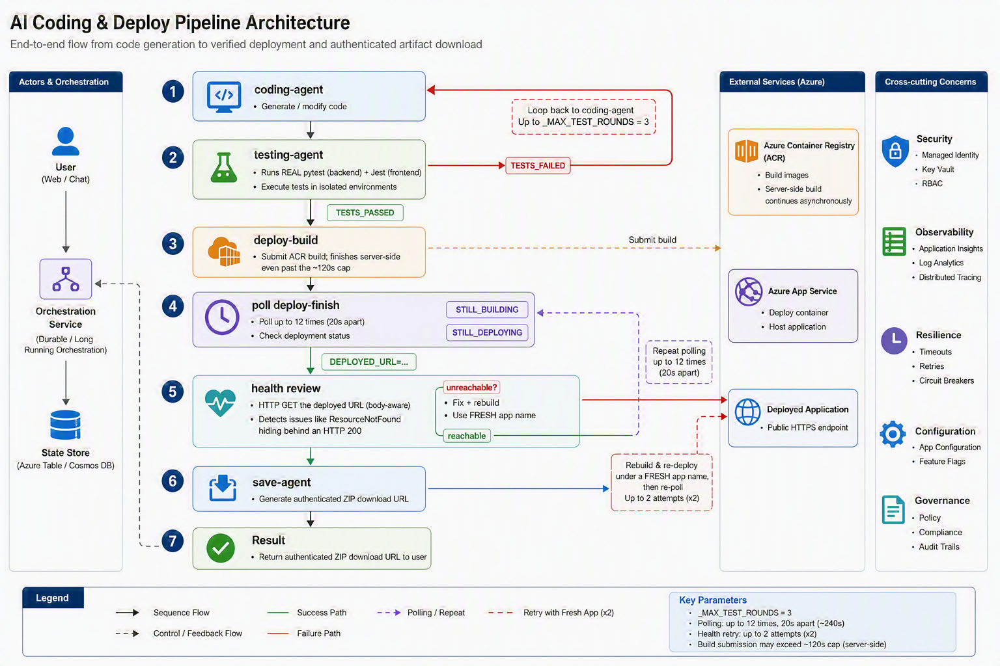
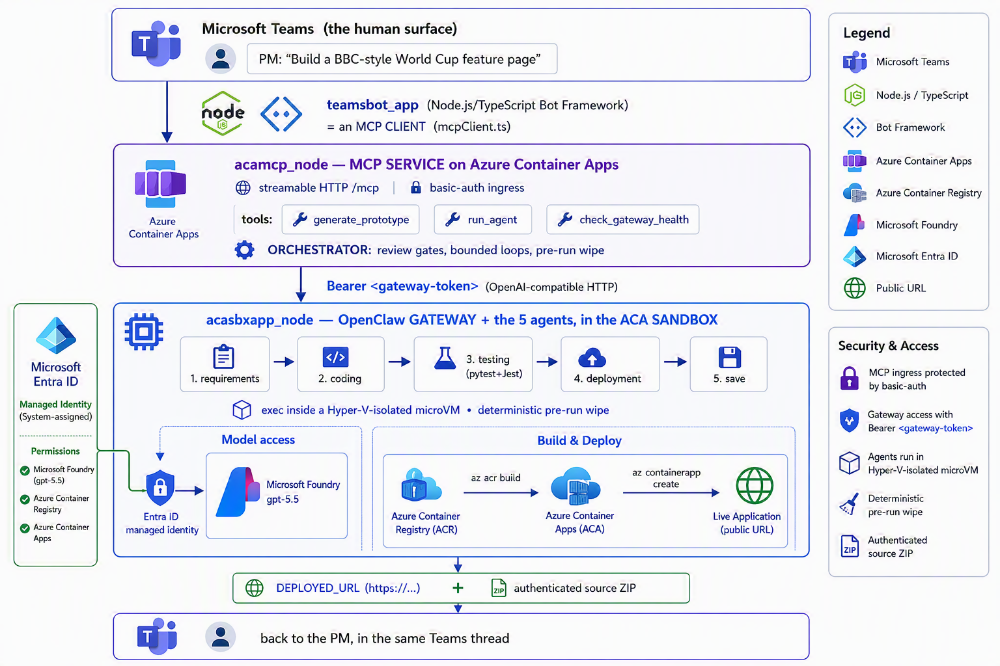

# 产品经理打一句话，Azure 就上线一个应用 —— 而且是安全的

### 用 OpenClaw、MCP 与 Azure Container Apps 沙箱，为长时运行的自主 Agent 搭一套可落地蓝图

*作者：Kinfey Lo · 微软高级云技术布道师（Senior Cloud Advocate）*

---

## 真正改变一切的那个转变

过去两年，"AI 写代码"约等于自动补全：编辑器里弹出一段建议，你按下 Tab，接着往下写。Agent 只在你**正在敲键盘**的那一刻存在。

现在这已经不是唯一的形态了。一类全新的工具开始**异步、自主**地运行：你在聊天窗口里——Teams、Slack、Telegram——给它发一条消息，把需求讲清楚，然后**转身走人**。Agent 自己去规划、写代码、跑测试、做部署，最后把结果丢回给你。有些 Agent 甚至从不休眠：它拥有持久记忆、会自己加载技能，还能按计划**主动**行动，根本不需要你先发话。

这就是 **OpenClaw**、**Hermes Agent** 以及 2026 年在开发者圈子里爆火的那批**长时运行自主 Agent** 所构建的世界。仅 OpenClaw 一个项目，GitHub Star 就突破了 37.7 万、活跃用户数以百万计，一度成为 GitHub 上 Star 最多的项目。你用一行命令装好它，接上一个聊天渠道，就能从手机上开始"派活"。

工作方式因此从**结对编程**转向了**委派 + 评审**。交互式 Copilot 问的是"我接下来写什么？"；自主 Agent 问的是"你要我把什么搞定？"

而正是这个转变，让三个问题开始让架构师们夜不能寐：

1. **它安全吗？** 你把一个会自己开车的进程，交到了能执行 Shell 命令、能读写文件、能调 API 的位置上。社区里有个说法很传神——这类 Agent 就像你群聊里的一位队友，只不过他手里握着你代码库的 root 权限。这不是夸奖，这是一份威胁模型。
2. **它能融入真正的多 Agent 协作吗？** 单个 Agent 只是 Demo；生产环境要的是一支**分工明确的舰队**——各司其职、彼此交接，中间还得有关卡。
3. **它够灵活、够可控吗？** 自主性一直很爽——直到 Agent 把上周残留的文件打包进了这周的交付物，或者在一个失败的测试上无限循环。

这篇文章要把这三个问题都回答掉——不是空谈，而是一份你今天就能克隆下来的**可运行参考实现**：`Multi-AI-Agents-Cloud-Native` 仓库中的 **[`CustomCodingAgentApp`](https://github.com/kinfey/Multi-AI-Agents-Cloud-Native/tree/main/code/CustomCodingAgentApp)**，一座**"Agent 原型工厂"（Agentic Prototype Factory）**，它能把一句自然语言需求，变成一个**经过测试、已在 Azure 上线**的原型——**全程不离开聊天窗口**。

> 一位产品经理在 **Microsoft Teams** 里输入 *"帮我做一个 BBC 风格的世界杯专题页"*。几分钟后，他拿回的是一个**可访问的 HTTPS URL** 和一个**可下载的源码 ZIP**。在幕后，五个各有专长的 **OpenClaw** Agent、由 **Microsoft Foundry `gpt-5.5`** 驱动，在同一个沙箱里协作，跑真实的 `pytest`/`Jest` 测试套件，并把成果发布到 **Azure Container Apps**——这一切都被封装在一个 **Model Context Protocol（MCP）** 服务背后，因此任何 MCP 客户端（GitHub Copilot、Claude、Teams 机器人）都能驱动它。

我们按照"你应该学习它的顺序"，一层层把这套架构搭起来。

---

## 第一部分 —— 长时运行自主 Agent，以及它绕不开的两道难题

### 它到底"不一样"在哪里

传统聊天机器人是**文字进、文字出**，它等你发话。自主 Agent 则把这套逻辑反了过来：

| 特性 | 传统聊天机器人 | 长时运行自主 Agent |
| --- | --- | --- |
| 执行方式 | 被动响应提示 | 主动行动（"心跳"按计划唤醒它） |
| 作用范围 | 只有文字 | 文件、Shell、浏览器、API——真实的机器 |
| 记忆 | 仅限本次会话 | 跨会话持久保留 |
| 交互入口 | 一个网页输入框 | 任意聊天渠道 + 终端 |
| 自主性 | 无 | 自己规划并执行多步动作 |

从架构上看，OpenClaw 不是一个你 import 进来的库，而是一套**运行时**。一个长时运行的单一进程（**Gateway 网关**）把你的聊天渠道桥接到 LLM 后端，维持会话不掉线，用有序的队列（lane）排布任务，并驱动经典的 Agent 循环：*调用模型 → 执行它请求的工具调用 → 把结果喂回去 → 循环直到完成*。这里没有僵硬的步骤规划器，是模型自己在掌舵。这正是它"魔法感"的来源——也正是它难以被"关进笼子"的原因。

而"关进笼子"这件事，有两副面孔。

### 难题一 —— 安全

让自主 Agent 有用的那些特性，恰恰也让它危险。**完全的系统访问权 + 主动执行 + 一个三万多台服务器的工具生态**，合起来就是一个巨大的、会自己开车的攻击面。OpenClaw 自己的短暂历史就是一部警世录：项目早期爆出过**一个"一键"远程代码执行（RCE）严重漏洞**，社区技能市场上被发现了**数百个恶意"技能"（skills）**，还有**数以万计的网关被发现直接暴露在公网上**。这些都不是在说"别用自主 Agent"，而是在说：**永远不要让它带着环境里的现成凭据，跑在你在乎的机器上。** Agent 应该待在一个四周有硬墙的盒子里。

### 难题二 —— 持续性与连续性

真正的 Agent 工作是**长活儿**。重构一个代码库、跨几十个网页做调研、把一个应用一路构建-测试-部署下来——这些都要几分钟到几小时，远远超出单次请求/响应的范围。所以运行时需要持久会话、需要一个存放状态的地方、需要一个能跨步骤存活的工作区。但一个被**复用**的持久工作区，本身又埋下了隐患：**状态泄漏**。昨天那次任务的文件，可能污染——甚至被打包进——今天的交付物。**连续性**和**洁净度**这两股力量方向相反，你必须用工程手段把这股张力消解掉。

### 单个 Agent 是 Demo；生产环境是一支舰队

让一个庞大的单体 Agent 去"收集需求、写代码、测试、部署、打包"，结果是这四件事它都只做到**平庸**，而且彼此边界糊成一团。生产级的范式是**编排者-工作者（orchestrator-worker）**：一群各只干一件事的专职 Agent，通过**显式的关卡**逐个交接。OpenClaw 恰好支持这一点——它能派生子 Agent，甚至能调度外部的编码 harness，扮演一个**元编排者（meta-orchestrator）**，而不只是一个单模型工具。所以问题从来不是"要不要上多 Agent"，而是——**接缝和护栏该放在哪里**。

### "它安全吗"的答案：把 Agent 装进 microVM

如果 Agent 非得有 root 才好用，那就给它 root——但是**装进一个用完即弃的 microVM 里**，而不是你的宿主机上。到了 2026 年，实现这一点已经有好几条靠谱的路：

- **AKS 上的 Kata Containers** —— 每个 Pod 拥有自己轻量的虚拟机边界和独立的 guest 内核。
- **Hyperlight Wasm** —— 逐次调用、快照恢复的 Wasm microVM，专门用来跑 LLM 生成的代码。
- **Azure Container Apps 动态会话（dynamic sessions）** —— 预热好的、基于 **Hyper-V 隔离**的沙箱，**毫秒级**启动，可扩展到数千并发，天生就是为**"安全执行自定义代码"**和**"运行 LLM 生成的脚本"**而设计的。

最后这一条——**ACA 沙箱**——正是"聊天驱动的 Agent 工厂"的黄金选择：既有强隔离，又不需要你去运维一整个 Kubernetes 集群，还提供了一个 `exec` API 让你在盒子里执行命令。这也正是本参考实现所采用的方案。

---

## 第二部分 —— 把 OpenClaw *装进* ACA 沙箱

到这里，仓库不再是一张架构图，而是能跑起来的代码。**Agent 原型工厂**把"想法 → 上线应用"这件事，拆成了**五个各有专长、依次运行的 OpenClaw Agent**，全部跑在沙箱内部：

```
需求(requirements) → 编码(coding) → 测试(testing) → 部署(deployment) → 保存(save)
```

每个 Agent 在 OpenClaw 网关的 OpenAI 兼容 API 上，都是一个独立可寻址的 `model` 目标：

| `model` 取值 | 路由到 |
| --- | --- |
| `openclaw` / `openclaw/default` | 默认 Agent |
| `openclaw/requirements-agent` | 需求 Agent |
| `openclaw/coding-agent` | 编码 Agent |
| `openclaw/testing-agent` | 测试 Agent |
| `openclaw/deployment-agent` | 部署 Agent |
| `openclaw/save-agent` | 保存与下载 Agent |

### 是"可控"，不是"看心情"：带反馈回路的评审关卡

没有关卡的自主，最后就是一个自信满满地把坏应用部署上线的 Agent。编排器把这五个 Agent 连成一张图，中间卡着**硬性的、有上限的关卡**：




每一个旋钮都是显式的，都写在 `server.py` 里：`_MAX_TEST_ROUNDS = 3`、`_MAX_DEPLOY_REVIEW = 2`、`_DEPLOY_POLL_ATTEMPTS = 12`、`_DEPLOY_POLL_DELAY_S = 20`。测试 Agent 每一轮都必须以一个字面量 `TESTS_PASSED` / `TESTS_FAILED` 结论收尾；而编排器在**对已部署 URL 发起 HTTP 请求、并检查响应体**之前，绝不会宣布成功——因为一个 `ResourceNotFound` 完全可能返回 HTTP 200。这就是"灵活且可控"落到实处的样子：**LLM 在一台确定性状态机的内部，自由地发挥创造力。**

### 确定性的运行前清场（解决状态泄漏）

由于沙箱在多次运行之间是**被复用**的（快、省成本），编排器在**每一次**运行之前，都会做一件很有纪律的事：**清空所有残留的 Agent 工作区**。上一次任务的陈旧文件，绝无可能泄漏进——或被打包成——这一次的结果。这正是对"难题二"的工程化回答。

### 顺着沙箱的限制去设计，而不是硬顶

ACA 沙箱的 `exec` API **硬性上限约 120 秒**——比一次冷启动的 `az acr build` 加 `az containerapp create` 还要短。一个天真的 Agent 会在这里超时，然后报告失败。而巧妙之处在于：**这些命令即使在客户端 `exec` 断开之后，仍会在 Azure 服务端继续跑完。** 所以部署被拆成了两步：

1. **`deploy-build <dir> <app>`** —— 装好部署辅助脚本，写一个精简的 `.dockerignore`，然后启动打了 `<app>:latest` 标签的 ACR 构建。即使客户端在 ~120s 处掉线，镜像照样会落进 ACR。
2. **`deploy-finish <app>`** —— 幂等，最多轮询 12 次。镜像还没好时它一直报 `STILL_BUILDING`，镜像就绪后触发一个 `--no-wait` 的 `containerapp create`，最终返回 `DEPLOYED_URL=https://<fqdn>`。

这是整个示例里最重要的一课：**自主 Agent 需要的不是更长的超时时间，而是理解它所运行的平台的"持久性语义"。**

---

## 第三部分 —— MCP，以及为什么它的安全性就是全部胜负手

五 Agent 工作流很强，但如果唯一的调用方式是一套定制 API，它就成了一座孤岛。于是仓库把整套编排封装成了一个 **Model Context Protocol（MCP）** 服务（`acamcp_node`），通过可流式的 HTTP 暴露在 `/mcp` 上，工具面小而清晰：

| MCP 工具 | 作用 |
| --- | --- |
| `generate_prototype` | 端到端跑完整个五 Agent 工作流 |
| `run_agent` | 调用某一个指定的 Agent |
| `check_gateway_health` | OpenClaw 网关的存活/就绪检查 |

回报是巨大的：**任何** MCP 客户端现在都能驱动这座工厂——GitHub Copilot、Claude，或者我们马上要见到的 Teams 机器人。**一套协议，多个前端。**

但 MCP 不只是一个集成上的便利，它是一个**控制平面**，而**每一个 MCP 工具都是一项特权能力**。在一个拥有三万多台社区服务器的生态里，"随手加一个 MCP 服务器"其实是一个**供应链决策**。一次工具调用，本质上就是一次代码执行。所以安全姿态必须是刻意为之的。下面是这份参考实现的加固方式——而这些原则可以迁移到任何 MCP 部署上：

- **把鉴权放在协议前面。** MCP 入口挡在**基础认证（basic auth）**之后（`MCP_BASIC_AUTH_PASSWORD`）；网关本身要求把网关令牌作为 **Bearer 凭据**（`Authorization: Bearer <token>`）。没有匿名的工具调用。
- **一份小而具名的白名单，而不是一张空白支票。** 网关只路由到六个显式的 `model` 目标。不存在"随便跑任意 Agent"的后门；这张路由表**本身就是**白名单。
- **工作负载里没有任何密钥。** 运行中的容器里**没有任何模型 API Key**——模型访问完全通过 **Entra ID 托管标识（managed identity）** 来代理。网关令牌以 Kubernetes Secret 形式存放，**绝不烘进镜像**。
- **默认私有。** 网关的 OpenAI 兼容端点是**运维级（operator-level）访问**——它始终待在**私有入口（private ingress）**后面，任何对外暴露之前都要先加上 TLS 与鉴权。
- **在标识层做最小权限。** 网关只被授予它真正需要的那几个 Foundry 角色（`Cognitive Services User` / `Cognitive Services OpenAI User`），仅此而已。

对 MCP 的结论，和对 Agent 本身的结论是同一句话：**把协议当成一扇门，然后在门口安一个卫兵。** 鉴权、显式白名单、私有入口、代理式标识——这四样，把 MCP 从一个敞开的爆炸半径，变成了一个受治理的控制平面。

---

## 第四部分 —— 完整方案：Teams + ACA 上的 MCP + ACA 沙箱里的 OpenClaw

现在把三个可部署组件拼进同一个闭环：




### 端到端的一次请求生命周期

1. PM 在 **Teams** 里发一句话。`teamsbot_app` 机器人——通过 `mcpClient.ts` 扮演一个 **MCP 客户端**——发起 MCP 握手，调用 `generate_prototype`。
2. **ACA 上的 MCP 服务**（`acamcp_node`）运行编排器：先做**运行前清场**，然后是 需求 → 编码 → 测试。
3. **ACA 沙箱里的 OpenClaw 网关**（`acasbxapp_node`）执行每一个 Agent，通过**托管标识**与 **Foundry `gpt-5.5`** 对话——盒子里没有任何密钥。
4. 真实的 `pytest` + `Jest` 测试套件在沙箱内运行。失败 → 回退重试（有上限）；通过 → 部署。
5. 部署用**构建 + 轮询**的拆分方式扛过约 120 秒的 `exec` 上限；应用落到 **Azure Container Apps**，并在其上线 URL 上做**读响应体的健康检查**。
6. **保存 Agent** 产出一个带鉴权的 **ZIP** 下载 URL。机器人把每个 Agent 的进度实时回流到 Teams 线程里，最后返回**可访问的 HTTPS URL + 源码 ZIP**——还可以顺手用 VS Code Insiders 自动打开这个项目。

### 这套架构如何回答那三个问题

| 问题 | 这套方案的回答 |
| --- | --- |
| **它安全吗？** | 自主 Agent 跑在一个 **Hyper-V 隔离的 ACA 沙箱**里，而不是任何人的笔记本上。工作负载里**没有模型密钥**——由 **Entra ID 托管标识**代理 Foundry。MCP 挡在**基础认证**后面；网关挡在**私有入口**上的 **Bearer 令牌**后面；令牌是 **Secret，绝不进镜像**。**确定性的运行前清场**消除了跨运行的状态泄漏。 |
| **它能融入多 Agent 协作吗？** | 它**本身就是**一个多 Agent 系统——五个专职 OpenClaw Agent，带 **A2A 交接与评审关卡**——而且因为它通过 **MCP** 暴露，*任何*客户端（Copilot、Claude、Teams）都能来编排它。 |
| **它够灵活、够可控吗？** | 创造力被约束在**一台确定性状态机内部**：显式的 `TESTS_PASSED/FAILED` 结论、**有上限**的重试循环（`_MAX_TEST_ROUNDS`、`_MAX_DEPLOY_REVIEW`）、**读响应体**的健康检查，以及一个在 Teams 线程里点头的人。 |

### 自己动手部署

仓库为三个层级都提供了脚本（网关用平台的**托管标识**去访问 Foundry——不碰任何密钥，也不用重建镜像）：

```bash
# 1) OpenClaw 网关 + 5 个 Agent （acasbxapp_node）
cd acasbxapp_node
cp .env.example .env               # 网关令牌、Foundry 端点、沙箱 id
./scripts/build-openclaw-image.sh  # 构建并推送 OpenClaw 镜像到 ACR
./scripts/deploy-aks-gateway.sh    # 授予 Foundry 角色 + 部署

# 2) MCP 服务 （acamcp_node）
cd ../acamcp_node
cp .env.example .env               # ACR + 集群；网关令牌从 ../acasbxapp_node/.env 读取
./scripts/build-images.sh          # 构建并推送 MCP 镜像
./scripts/deploy-aks.sh            # 把 Secret + 清单部署到 openclaw 命名空间
./scripts/smoke-check.sh           # 验证 MCP 握手

# 3) Teams 机器人 （teamsbot_app）—— Node.js/TypeScript 的 MCP 客户端
cd ../teamsbot_app
# 按该目录的 README 配置并运行，然后侧载 Teams 应用包
```

> 该参考实现面向 **Azure（ACA + AKS）**——OpenClaw 网关与 MCP 服务以容器形式运行，而**代码执行沙箱**使用 **ACA 动态会话的 `exec` API**。生产环境请把网关保持在私有入口上，任何对外暴露之前先加 TLS。

---

## 结语

把"世界杯 Demo"这层外衣剥掉，剩下的是一个可复用的范式——一份在企业里运行**任何**长时运行自主 Agent 的蓝图：

> **一个消息驱动的 Agent**（OpenClaw / Hermes）**+ 一个 microVM 沙箱**（Azure Container Apps 动态会话）**+ 一个带鉴权的 MCP 控制平面** **+ 企业级标识**（Entra ID 托管标识）**+ 一个人机界面**（Microsoft Teams）。

让这些 Agent 爆火的那份自主性，恰恰也是让安全团队紧张的那份自主性。你不是靠**把 Agent 变慢**来化解这股张力，而是靠——**给它一个四周有硬墙的盒子、一个门口有卫兵的控制平面、一份标识而不是一个密钥，再加上一个在回路里的人。** 做到这些，"产品经理打一句话、Azure 就上线一个应用"就不再是一个吓人的 Demo，而是一件你真的可以放进生产的事。

克隆它、拆解它、把它加固得更结实：
**[`kinfey/Multi-AI-Agents-Cloud-Native` → `code/CustomCodingAgentApp`](https://github.com/kinfey/Multi-AI-Agents-Cloud-Native/tree/main/code/CustomCodingAgentApp)**

*聊天窗口，就是新的终端。让我们把它做成一个安全的终端。*
