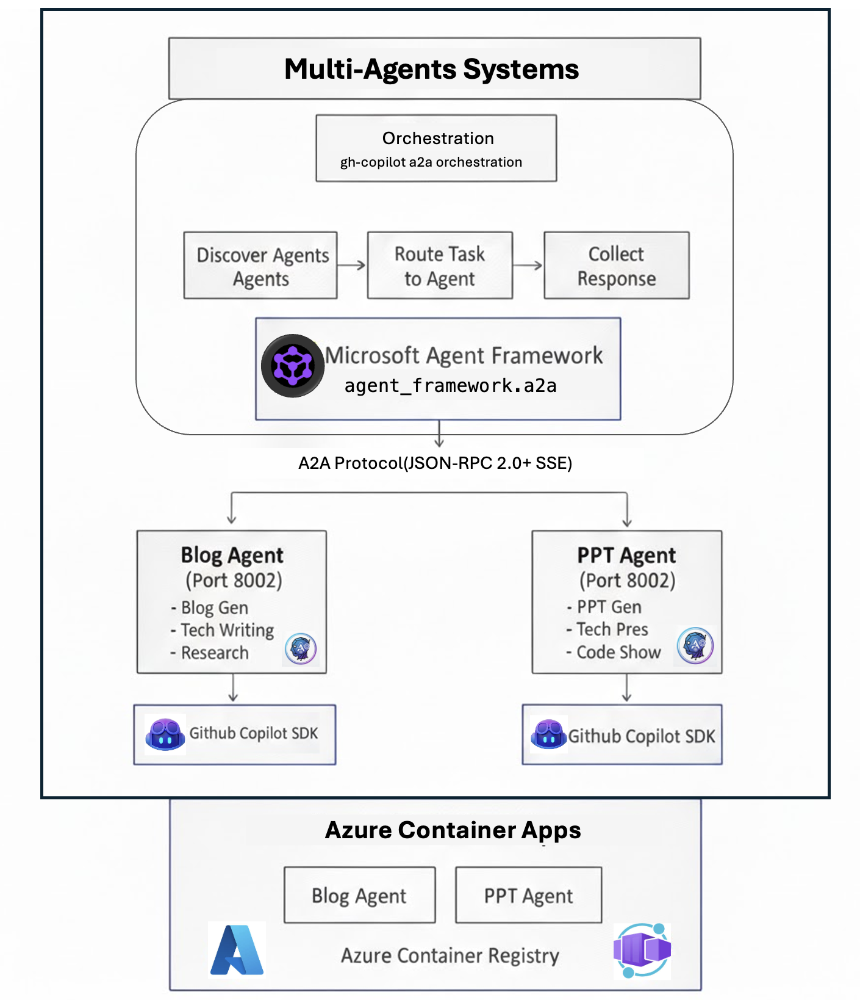

# GitHub Copilot Agents with A2A Protocol

A multi-agent system that leverages **GitHub Copilot SDK** and the **Agent-to-Agent (A2A) Protocol** for intelligent task orchestration. This project demonstrates how to build specialized AI agents that can communicate and collaborate through the A2A protocol.

## Table of Contents

- [Project Overview](#project-overview)
- [Architecture](#architecture)
- [Installation Requirements](#installation-requirements)
- [Project Structure](#project-structure)
- [Key Technical Code Snippets](#key-technical-code-snippets)
- [Deployment](#deployment)
- [Related Resources](#related-resources)

---

## Project Overview

This project implements a **multi-agent orchestration system** with the following capabilities:

- **Blog Agent**: Generates comprehensive, well-researched technical blog posts using GitHub Copilot SDK with DeepSearch integration
- **PPT Agent**: Creates professional presentations with code examples and technical content
- **Orchestrator**: Intelligently routes tasks to the appropriate agent based on capabilities and keywords

### Key Features

- 🤖 **A2A Protocol Compliance**: Full implementation of the Agent-to-Agent protocol specification
- 🔄 **Intelligent Task Routing**: Auto-selects the best agent based on task content and agent capabilities
- 📡 **Server-Sent Events (SSE)**: Real-time streaming responses for long-running tasks
- 🐳 **Cloud-Native Ready**: Containerized agents deployable to Azure Container Apps
- 🔐 **Secure Configuration**: Environment-based secret management

---

## Architecture



### A2A Protocol Flow

```
┌──────────┐                    ┌──────────┐                    ┌──────────┐
│  Client  │                    │Orchestrator│                  │  Agent   │
└────┬─────┘                    └─────┬─────┘                   └────┬─────┘
     │                                │                              │
     │  1. Send Task                  │                              │
     │───────────────────────────────>│                              │
     │                                │                              │
     │                                │  2. Discover Agent           │
     │                                │  GET /.well-known/agent-card.json
     │                                │─────────────────────────────>│
     │                                │                              │
     │                                │  3. Agent Card Response      │
     │                                │<─────────────────────────────│
     │                                │                              │
     │                                │  4. Route & Send Task        │
     │                                │  POST / (JSON-RPC 2.0)       │
     │                                │─────────────────────────────>│
     │                                │                              │
     │                                │  5. SSE Stream Response      │
     │                                │<─ ─ ─ ─ ─ ─ ─ ─ ─ ─ ─ ─ ─ ─│
     │                                │     (status-update)          │
     │                                │     (artifact-update)        │
     │                                │     (completed)              │
     │                                │                              │
     │  6. Final Response             │                              │
     │<───────────────────────────────│                              │
     │                                │                              │
```

---

## Installation Requirements

### Prerequisites

- **Python**: 3.12+
- **Node.js**: 20+
- **Docker**: For containerized deployment
- **Azure CLI**: For Azure Container Apps deployment
- **Git**: For version control

### Python Dependencies

```bash
# For Agents (Blog Agent / PPT Agent)
pip install fastapi
pip install github-copilot-sdk
pip install python-dotenv
pip install uvicorn

# For Orchestrator
pip install httpx
pip install python-dotenv
pip install a2a-sdk>=0.2.0
pip install agent-framework>=0.1.0
```

### Environment Variables

Create a `.env` file in each component directory:

```bash
# For Agents
COPILOT_GITHUB_TOKEN=your_github_copilot_token
AGENT_PORT=8001  # or 8002 for PPT Agent

# For Orchestrator
A2A_AGENT_HOST=https://blog-agent.example.com,https://ppt-agent.example.com
```

---

## Project Structure

```
GitHubCopilotAgents_A2A/
├── README.md
├── gh-copilot-multi-agents/           # Individual AI Agents
│   ├── gh-cli-blog-agent/             # Blog Generation Agent
│   │   ├── main.py                    # FastAPI application with A2A endpoints
│   │   ├── requirements.txt           # Python dependencies
│   │   ├── Dockerfile                 # Container configuration
│   │   ├── deploy-to-aca.sh          # Azure Container Apps deployment script
│   │   ├── .copilot_skills/          # Copilot skill definitions
│   │   │   └── blog/
│   │   │       └── SKILL.md          # Blog skill specification
│   │   └── blog/                      # Generated blog outputs
│   │
│   └── gh-cli-ppt-agent/              # PPT Generation Agent
│       ├── main.py                    # FastAPI application with A2A endpoints
│       ├── requirements.txt           # Python dependencies
│       ├── Dockerfile                 # Container configuration
│       ├── deploy-to-aca.sh          # Azure Container Apps deployment script
│       ├── .copilot_skills/          # Copilot skill definitions
│       │   └── ppt/
│       │       └── SKILL.md          # PPT skill specification
│       └── ppt/                       # Generated PPT outputs
│
└── multi-agents-orchestrations/       # Orchestration Layer
    └── gh-copilot-a2a-orchestration/
        ├── main.py                    # Multi-agent orchestrator with auto-routing
        ├── requirements.txt           # Python dependencies
        └── .env                       # Configuration (agent URLs)
```

---

## Key Technical Code Snippets

### 1. A2A Agent Card Endpoint

Each agent exposes its capabilities through a well-known endpoint:

```python
@app.get("/.well-known/agent-card.json")
async def agent_card():
    """A2A Protocol: Agent Card endpoint for discovery"""
    return JSONResponse({
        "name": "blog_agent",
        "description": "Blog generation agent with DeepSearch",
        "version": "1.0.0",
        "url": "https://your-agent-url.azurecontainerapps.io",
        "protocol": "a2a",
        "protocolVersion": "0.2.0",
        "defaultInputModes": ["text"],
        "defaultOutputModes": ["text"],
        "primaryKeywords": ["blog", "article", "write"],
        "skills": [
            {
                "id": "blog_generation",
                "name": "Blog Generation",
                "description": "Generate technical blog posts",
                "tags": ["blog", "writing"],
                "examples": ["Write a blog about GitHub Copilot SDK"]
            }
        ],
        "capabilities": {
            "streaming": True,
            "pushNotifications": False
        }
    })
```

### 2. SSE Streaming Response Handler

Real-time streaming using Server-Sent Events:

```python
async def process_a2a_message_streaming(message_text: str, jsonrpc: str, 
                                        request_id: str, task_id: str, 
                                        context_id: str):
    """Process A2A message and yield SSE events"""
    
    # Send working status
    status_event = {
        "jsonrpc": jsonrpc,
        "id": request_id,
        "result": {
            "contextId": context_id,
            "taskId": task_id,
            "final": False,
            "status": {
                "state": "working",
                "message": {
                    "messageId": str(uuid.uuid4()),
                    "role": "agent",
                    "parts": [{"kind": "text", "text": "Processing..."}]
                }
            },
            "kind": "status-update"
        }
    }
    yield f"data: {json.dumps(status_event)}\n\n"
    
    # Process with GitHub Copilot SDK
    session = await copilot_client.create_session({
        "model": "claude-sonnet-4.5",
        "streaming": True,
        "skill_directories": [SKILLS_DIR]
    })
    
    # ... task execution ...
    
    # Send completion event
    complete_event = {
        "jsonrpc": jsonrpc,
        "id": request_id,
        "result": {
            "contextId": context_id,
            "taskId": task_id,
            "final": True,
            "status": {"state": "completed"},
            "kind": "status-update"
        }
    }
    yield f"data: {json.dumps(complete_event)}\n\n"
```

### 3. Intelligent Task Router

The orchestrator routes tasks based on agent capabilities:

```python
@dataclass
class AgentInfo:
    """Agent information with capabilities for routing"""
    agent: A2AAgent
    name: str
    primary_keywords: List[str]
    
    def matches_task(self, task: str, all_agents_keywords: Dict) -> float:
        """Calculate relevance score for task routing"""
        task_lower = task.lower()
        score = 0.0
        
        # Check primary keywords (highest priority)
        for keyword in self.primary_keywords:
            if keyword.lower() in task_lower:
                score += 0.5
        
        # Negative scoring for other agents' keywords
        for other_agent, other_keywords in all_agents_keywords.items():
            if other_agent != self.name:
                for keyword in other_keywords:
                    if keyword.lower() in task_lower:
                        score -= 0.3
        
        return max(0.0, min(score, 1.0))
```

### 4. GitHub Copilot SDK Integration

Using the Copilot SDK for AI-powered content generation:

```python
from copilot import CopilotClient
from copilot.generated.session_events import SessionEventType

# Initialize client
copilot_client = CopilotClient()
await copilot_client.start()

# Create session with skill
session = await copilot_client.create_session({
    "model": "claude-sonnet-4.5",
    "streaming": True,
    "skill_directories": ["/path/to/skills/SKILL.md"]
})

# Handle streaming response
response_chunks = []
def handle_event(event):
    if event.type == SessionEventType.ASSISTANT_MESSAGE_DELTA:
        response_chunks.append(event.data.delta_content)

session.on(handle_event)
await session.send_and_wait({"prompt": task}, timeout=600)
```

---

## Deployment

### Local Development

```bash
# Start Blog Agent
cd gh-copilot-multi-agents/gh-cli-blog-agent
pip install -r requirements.txt
python main.py

# Start PPT Agent (in another terminal)
cd gh-copilot-multi-agents/gh-cli-ppt-agent
pip install -r requirements.txt
python main.py

# Start Orchestrator (in another terminal)
cd multi-agents-orchestrations/gh-copilot-a2a-orchestration
pip install -r requirements.txt
python main.py
```

### Deploy to Azure Container Apps

```bash
# Deploy Blog Agent
cd gh-copilot-multi-agents/gh-cli-blog-agent
chmod +x deploy-to-aca.sh
./deploy-to-aca.sh

# Deploy PPT Agent
cd gh-copilot-multi-agents/gh-cli-ppt-agent
chmod +x deploy-to-aca.sh
./deploy-to-aca.sh
```

---

## Related Resources

### Documentation

- [A2A Protocol Specification](https://a2a-protocol.org/latest/) - Official A2A protocol documentation
- [GitHub Copilot SDK](https://github.com/github/copilot-sdk) - GitHub Copilot SDK for Python, Node.js, Go, and .NET
- [FastAPI Documentation](https://fastapi.tiangolo.com/) - Modern web framework for building APIs

### Azure Resources

- [Azure Container Apps](https://learn.microsoft.com/en-us/azure/container-apps/) - Serverless container hosting
- [Azure Container Registry](https://learn.microsoft.com/en-us/azure/container-registry/) - Docker container registry

### Related Projects

- [Microsoft Agent Framework](https://github.com/microsoft/agent-framework) - Framework for building AI agents
- [A2A SDK](https://pypi.org/project/a2a-sdk/) - Python SDK for A2A protocol

### Tutorials

- [Building Multi-Agent Systems](https://github.com/kinfey/Multi-AI-Agents-Cloud-Native) - Parent repository with more examples
- [Running Copilot CLI in Docker](https://gordonbeeming.com/blog/2025-10-03/taming-the-ai-my-paranoid-guide-to-running-copilot-cli-in-a-secure-docker-sandbox) - Secure Docker sandbox guide

---

## License

This project is part of the [Multi-AI-Agents-Cloud-Native](https://github.com/kinfey/Multi-AI-Agents-Cloud-Native) repository.

## Author

**Kinfey Lo** - [GitHub](https://github.com/kinfey)
