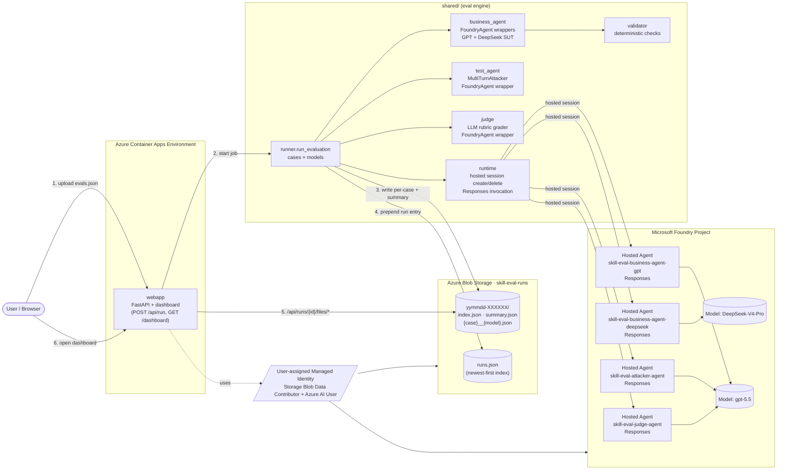

# azure_skill_eval

Foundry-backed mirror of `ghcsdk_skill_eval`, rebuilt on:

| Layer | Technology |
| --- | --- |
| Business agent (system under test) | **Foundry Hosted Agents** `skill-eval-business-agent-gpt` and `skill-eval-business-agent-deepseek`, invoked by Agent Framework `FoundryAgent` |
| Attacker / judge | **Foundry Hosted Agents** `skill-eval-attacker-agent` and `skill-eval-judge-agent` |
| Storage | **Azure Blob Storage** — every run goes into a `yymmdd-XXXXXX` folder |
| UI | **FastAPI** on **Azure Container Apps** — upload `evals.json`, watch progress, browse the dashboard |
| Auth | Managed Identity in the cloud (Storage Blob Data Contributor + Azure AI User); `AzureCliCredential` locally |

## Architecture



```
azure_skill_eval/
├── azure.yaml                         # azd services: 4 Foundry Hosted Agents + webapp
├── requirements.txt                   # local eval/webapp dependencies
├── evals/                             # canonical evals.json + exporter
├── infra/                             # Bicep: Storage, ACA, identity, RBAC
│   └── modules/
├── shared/                            # shared eval engine used by webapp
│   ├── business_agent.py              # SUT wrappers; always Foundry Hosted Agent
│   ├── test_agent.py                  # attacker wrapper; Foundry Hosted Agent
│   ├── judge.py                       # judge wrapper; Foundry Hosted Agent
│   ├── runtime.py                     # hosted session create/delete + invocation helpers
│   ├── runner.py                      # ghcsdk-style single/multi-turn eval pipeline
│   ├── validator.py                   # deterministic template checks
│   ├── blob_store.py                  # Azure Blob artifact store
│   ├── config.py                      # models, hosted-agent names/versions, eval defaults
│   └── test_cases.py                  # built-in 10 edge cases + evals.json loader
├── src/
│   ├── skill-eval-business-agent-gpt/       # Hosted SUT container (gpt-5.5)
│   │   ├── main.py
│   │   ├── agent.yaml
│   │   ├── Dockerfile
│   │   ├── skills/edu-video-script/
│   │   └── shared/
│   ├── skill-eval-business-agent-deepseek/  # Hosted SUT container (DeepSeek-V4-Pro)
│   │   ├── main.py
│   │   ├── agent.yaml
│   │   ├── Dockerfile
│   │   ├── skills/edu-video-script/
│   │   └── shared/
│   ├── skill-eval-attacker-agent/           # Hosted attacker prompt generator
│   │   ├── main.py
│   │   ├── agent.yaml
│   │   └── Dockerfile
│   └── skill-eval-judge-agent/              # Hosted rubric JSON grader
│       ├── main.py
│       ├── agent.yaml
│       └── Dockerfile
├── webapp/                            # FastAPI upload UI + dashboard
│   ├── app.py
│   ├── Dockerfile
│   ├── templates/index.html
│   └── static/dashboard.html
└── hosted_agent/                      # legacy/shared skill provisioning assets
    ├── provision_skills.py
    └── skills/edu-video-script/
```

---

## 1. Prerequisites

* Conda env `agentdev` with Python 3.11+ (managed by the user)
* Azure subscription + an existing **Foundry project** with `gpt-5.5` and `DeepSeek-V4-Pro` model deployments
* Azure CLI logged in: `az login`
* `azd` ≥ 1.25 with the `azure.ai.agents` extension for Foundry Hosted Agent deployment

## 2. Local quickstart (no deployment)

```bash
conda activate agentdev
cd Skill_eval/azure_skill_eval
pip install -r requirements.txt
cp .env.example .env       # fill in FOUNDRY_PROJECT_ENDPOINT + AZURE_STORAGE_*

# Start the upload UI on http://localhost:8000
uvicorn webapp.app:app --reload --port 8000
```

Then open <http://localhost:8000>, upload `evals/evals.json`, and click **Run**.
Per-case JSON + `summary.json` + `index.json` land in Blob under
`{AZURE_STORAGE_CONTAINER}/{yymmdd-XXXXXX}/...`. The dashboard polls the
backend, which proxies straight to Blob.

The upload page mirrors the source runner switches: choose all models, GPT only,
or DeepSeek only; optionally set a single case id such as `edge-03`, toggle
adversarial mode, single-turn mode, judge grading, and max turns. The same
controls are available on `POST /api/run` as query parameters: `model`,
`only_case`, `use_attack`, `single_turn`, `use_judge`, and `max_turns`.

## 3. Cloud deploy (azd)

```bash
azd auth login
azd env new skill-eval-dev
azd env set FOUNDRY_PROJECT_ENDPOINT https://<project>.services.ai.azure.com/api/projects/<project>
azd env set MODEL_GPT gpt-5.5
azd env set MODEL_DEEPSEEK DeepSeek-V4-Pro
azd up
```

`azd up` will:

1. Run `infra/main.bicep` — Storage account + `skill-eval-runs` container + Log Analytics + Container Apps Environment + User-assigned Managed Identity + role assignments.
2. Build and deploy the **webapp** container app (public FQDN printed at the end).
3. The business SUT, attacker, and judge are invoked through Foundry Hosted Agents configured by `FOUNDRY_AGENT_NAME_*`.

Set the Foundry Hosted Agent names used by the webapp:

```bash
azd env set FOUNDRY_AGENT_NAME_GPT skill-eval-business-agent-gpt
azd env set FOUNDRY_AGENT_NAME_DEEPSEEK skill-eval-business-agent-deepseek
azd env set FOUNDRY_AGENT_NAME_ATTACKER skill-eval-attacker-agent
azd env set FOUNDRY_AGENT_NAME_JUDGE skill-eval-judge-agent
azd env set REQUIRE_FOUNDRY_AGENT 1

# azd azure.ai.agent service bindings used by `azd ai agent show/invoke`.
azd env set AGENT_SKILL_EVAL_BUSINESS_AGENT_GPT_NAME skill-eval-business-agent-gpt
azd env set AGENT_SKILL_EVAL_BUSINESS_AGENT_DEEPSEEK_NAME skill-eval-business-agent-deepseek
azd env set AGENT_SKILL_EVAL_ATTACKER_AGENT_NAME skill-eval-attacker-agent
azd env set AGENT_SKILL_EVAL_JUDGE_AGENT_NAME skill-eval-judge-agent

azd deploy webapp
```

## 4. Foundry Hosted Agent deployment

The business, attacker, and judge agents are deployed to Foundry, not to Azure Container Apps. The
`azure.yaml` services use `host: azure.ai.agent` and `docker.remoteBuild: true`,
so `azd deploy` builds the containers in Azure Container Registry. Local Docker
does not need to be running.

The agent source follows the Agent Framework Foundry hosted-agent samples under
`python/samples/04-hosting/foundry-hosted-agents/responses`.

Provision the skill once:

```bash
python -m hosted_agent.provision_skills
```

For existing `azure.yaml` services, redeploy the Foundry hosted agents with
`azd deploy`:

```bash
azd deploy skill-eval-attacker-agent
azd deploy skill-eval-judge-agent
azd deploy skill-eval-business-agent-gpt
azd deploy skill-eval-business-agent-deepseek
```

Use `azd ai agent init` only when adding a new agent service to the project for
the first time. Re-running `init` against an existing service may prompt to
overwrite the service directory or rewrite service configuration.

Verify and smoke test the hosted agents:

```bash
azd ai agent show skill-eval-business-agent-gpt
azd ai agent show skill-eval-business-agent-deepseek
azd ai agent show skill-eval-attacker-agent
azd ai agent show skill-eval-judge-agent
azd ai agent invoke skill-eval-business-agent-gpt "请为「P vs NP 问题」写一个教育短视频脚本。"
azd ai agent invoke skill-eval-business-agent-deepseek "请只回复：ok"
azd ai agent invoke skill-eval-attacker-agent "知识点：P vs NP 问题\n本次建议使用的攻击策略：长度极端\n请输出唯一的用户提示文本。"
azd ai agent invoke skill-eval-judge-agent "请只返回一个 JSON 对象，overall_pass=true, score=100, checks=[]。"
```

The webapp invokes those deployed agents using the official sample pattern:
`AIProjectClient(..., allow_preview=True)` + `FoundryAgent(..., allow_preview=True)`
and an explicit `beta.agents.create_session(...)` call per eval turn.

After deployment, verify the agent names are set:

```bash
azd env get-values | grep -E 'FOUNDRY_AGENT_NAME|AGENT_SKILL_EVAL_BUSINESS_AGENT'
```

## 5. Regenerating `evals.json`

```bash
python -m evals.export_evals      # writes evals/evals.json from shared/test_cases.py
```

## 6. Run artefacts on Blob

```
skill-eval-runs/
├── runs.json                          # newest-first index, one entry per run
└── 260610-7f3a91/
    ├── index.json                     # per-run manifest (cases, models, options)
    ├── summary.json                   # aggregates (pass rate, judge averages)
    ├── edge-01__GPT-5.5.json
    ├── edge-01__DeepSeek-V4-Pro.json
    └── ...
```

The webapp's `/api/runs/{run_id}/files/{filename}` endpoint streams those
files directly from Blob to the dashboard.

## 7. Environment variables (full list)

See `.env.example`. The most important ones are:

| Variable | Default | Purpose |
| --- | --- | --- |
| `FOUNDRY_PROJECT_ENDPOINT` | _(required)_ | Foundry project to call |
| `MODEL_GPT` | `gpt-5.5` | model deployment name |
| `MODEL_DEEPSEEK` | `DeepSeek-V4-Pro` | model deployment name |
| `MODEL_JUDGE` | `gpt-5.5` | model used by the LLM judge |
| `MODEL_ATTACKER` | `gpt-5.5` | model used by the multi-turn attacker |
| `FOUNDRY_AGENT_NAME_GPT` | `skill-eval-business-agent-gpt` | GPT business SUT hosted agent |
| `FOUNDRY_AGENT_NAME_DEEPSEEK` | `skill-eval-business-agent-deepseek` | DeepSeek business SUT hosted agent |
| `FOUNDRY_AGENT_NAME_ATTACKER` | `skill-eval-attacker-agent` | adversarial prompt hosted agent |
| `FOUNDRY_AGENT_NAME_JUDGE` | `skill-eval-judge-agent` | LLM-as-judge hosted agent |
| `FOUNDRY_AGENT_VERSION_*` | _empty_ | optional hosted-agent version pins; azd also writes `AGENT_*_VERSION` after deploy, and local empty values use `@latest` |
| `AZURE_STORAGE_ACCOUNT_URL` | _(required)_ | e.g. `https://<acct>.blob.core.windows.net` |
| `AZURE_STORAGE_CONTAINER` | `skill-eval-runs` | container name |
| `EVAL_USE_ATTACK` / `EVAL_USE_JUDGE` | `1` / `1` | toggle attacker + judge per default; `USE_ATTACK` / `USE_JUDGE` aliases are also accepted |
| `EVAL_MAX_TURNS` | `3` | multi-turn attacker depth; `MAX_TURNS` alias is also accepted |
