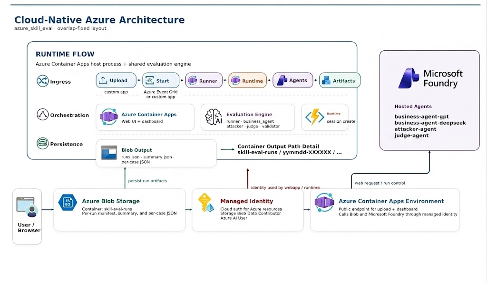
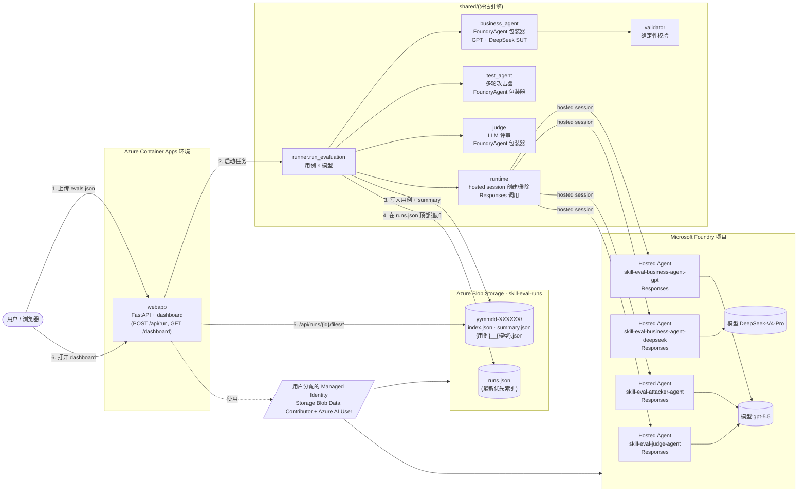

# azure_skill_eval(中文版)




`ghcsdk_skill_eval` 的 Foundry 版本,组件如下:

| 层 | 技术 |
| --- | --- |
| 被评估业务 Agent | **Foundry Hosted Agents** `skill-eval-business-agent-gpt` 和 `skill-eval-business-agent-deepseek`,由 Agent Framework `FoundryAgent` 调用 |
| 攻击 / 评审 Agent | **Foundry Hosted Agents** `skill-eval-attacker-agent` 和 `skill-eval-judge-agent` |
| 存储 | **Azure Blob Storage**——每次评估写入一个 `yymmdd-XXXXXX` 目录 |
| 前端 | **FastAPI** 部署在 **Azure Container Apps**——上传 `evals.json` → 实时跟踪 → 在 dashboard 浏览 |
| 鉴权 | 云端 Managed Identity(Storage Blob Data Contributor + Azure AI User);本地 `AzureCliCredential` |

## 架构图



```
azure_skill_eval/
├── azure.yaml                         # azd 服务:4 个 Foundry Hosted Agent + webapp
├── requirements.txt                   # 本地评估/webapp 依赖
├── evals/                             # 默认 evals.json + 导出脚本
├── infra/                             # Bicep:Storage、ACA、Identity、RBAC
│   └── modules/
├── shared/                            # webapp 复用的评估引擎
│   ├── business_agent.py              # SUT 包装器;始终调用 Foundry Hosted Agent
│   ├── test_agent.py                  # attacker 包装器;Foundry Hosted Agent
│   ├── judge.py                       # judge 包装器;Foundry Hosted Agent
│   ├── runtime.py                     # hosted session 创建/删除 + 调用辅助
│   ├── runner.py                      # 对齐 ghcsdk 的单轮/多轮评估流水线
│   ├── validator.py                   # 固定模板确定性校验
│   ├── blob_store.py                  # Azure Blob 产物存储
│   ├── config.py                      # 模型、hosted-agent 名称/版本、评估默认值
│   └── test_cases.py                  # 内置 10 个边界用例 + evals.json loader
├── src/
│   ├── skill-eval-business-agent-gpt/       # Hosted SUT 容器(gpt-5.5)
│   │   ├── main.py
│   │   ├── agent.yaml
│   │   ├── Dockerfile
│   │   ├── skills/edu-video-script/
│   │   └── shared/
│   ├── skill-eval-business-agent-deepseek/  # Hosted SUT 容器(DeepSeek-V4-Pro)
│   │   ├── main.py
│   │   ├── agent.yaml
│   │   ├── Dockerfile
│   │   ├── skills/edu-video-script/
│   │   └── shared/
│   ├── skill-eval-attacker-agent/           # Hosted 攻击提示生成器
│   │   ├── main.py
│   │   ├── agent.yaml
│   │   └── Dockerfile
│   └── skill-eval-judge-agent/              # Hosted rubric JSON 评审器
│       ├── main.py
│       ├── agent.yaml
│       └── Dockerfile
├── webapp/                            # FastAPI 上传页 + dashboard
│   ├── app.py
│   ├── Dockerfile
│   ├── templates/index.html
│   └── static/dashboard.html
└── hosted_agent/                      # legacy/shared skill 上传资源
    ├── provision_skills.py
    └── skills/edu-video-script/
```

---

## 1. 前置条件

* 由用户管理的 conda 环境 `agentdev`(Python 3.11+)
* Azure 订阅,且已存在一个 **Foundry 项目**,部署了 `gpt-5.5` 与 `DeepSeek-V4-Pro`
* `az login` 已完成
* `azd` ≥ 1.25,并安装 `azure.ai.agents` 扩展,用于部署 Foundry Hosted Agent

## 2. 本地启动(不部署)

```bash
conda activate agentdev
cd Skill_eval/azure_skill_eval
pip install -r requirements.txt
cp .env.example .env       # 填好 FOUNDRY_PROJECT_ENDPOINT + AZURE_STORAGE_*

# 启动上传页面:http://localhost:8000
uvicorn webapp.app:app --reload --port 8000
```

打开浏览器,上传 `evals/evals.json`,点击 **Run**;
每个用例的 JSON + `summary.json` + `index.json` 会写入
`{AZURE_STORAGE_CONTAINER}/{yymmdd-XXXXXX}/...`;dashboard 通过后端从 Blob 拉取。

上传页面保留了源 runner 的常用开关:可选择全部模型、仅 GPT 或仅 DeepSeek;
也可填写单个用例 id(例如 `edge-03`),并切换对抗模式、单轮模式、Judge 评审和最大轮数。
`POST /api/run` 也支持同样的 query 参数:`model`、`only_case`、`use_attack`、
`single_turn`、`use_judge`、`max_turns`。

## 3. 部署到 Azure(azd)

```bash
azd auth login
azd env new skill-eval-dev
azd env set FOUNDRY_PROJECT_ENDPOINT https://<project>.services.ai.azure.com/api/projects/<project>
azd env set MODEL_GPT gpt-5.5
azd env set MODEL_DEEPSEEK DeepSeek-V4-Pro
azd up
```

`azd up` 会:

1. 执行 `infra/main.bicep`——Storage 账户 + `skill-eval-runs` 容器 + Log Analytics + Container Apps Environment + 用户分配的 Managed Identity + 角色分配。
2. 构建并部署 **webapp** Container App(命令结尾会打印公网 FQDN)。
3. 被评估业务 Agent、攻击 Agent 和 Judge 都通过 `FOUNDRY_AGENT_NAME_*` 指向 Foundry Hosted Agents。

设置 webapp 使用的 Foundry Hosted Agent 名称:

```bash
azd env set FOUNDRY_AGENT_NAME_GPT skill-eval-business-agent-gpt
azd env set FOUNDRY_AGENT_NAME_DEEPSEEK skill-eval-business-agent-deepseek
azd env set FOUNDRY_AGENT_NAME_ATTACKER skill-eval-attacker-agent
azd env set FOUNDRY_AGENT_NAME_JUDGE skill-eval-judge-agent
azd env set REQUIRE_FOUNDRY_AGENT 1

# azd azure.ai.agent 服务绑定,供 `azd ai agent show/invoke` 使用。
azd env set AGENT_SKILL_EVAL_BUSINESS_AGENT_GPT_NAME skill-eval-business-agent-gpt
azd env set AGENT_SKILL_EVAL_BUSINESS_AGENT_DEEPSEEK_NAME skill-eval-business-agent-deepseek
azd env set AGENT_SKILL_EVAL_ATTACKER_AGENT_NAME skill-eval-attacker-agent
azd env set AGENT_SKILL_EVAL_JUDGE_AGENT_NAME skill-eval-judge-agent

azd deploy webapp
```

## 4. 部署 Foundry Hosted Agent

业务 Agent、攻击 Agent 和 Judge 都部署到 Foundry,不是 Azure Container Apps。`azure.yaml` 中这些服务使用
`host: azure.ai.agent` 和 `docker.remoteBuild: true`,因此 `azd deploy` 会在 Azure
Container Registry 中远程构建容器,本机不需要启动 Docker。

Agent 源码参考 Agent Framework 官方示例
`python/samples/04-hosting/foundry-hosted-agents/responses`。

先上传 skill 到 Foundry Skills:

```bash
python -m hosted_agent.provision_skills
```

对于已经存在于 `azure.yaml` 的服务,使用 `azd deploy` 重新部署 Foundry Hosted Agent:

```bash
azd deploy skill-eval-attacker-agent
azd deploy skill-eval-judge-agent
azd deploy skill-eval-business-agent-gpt
azd deploy skill-eval-business-agent-deepseek
```

只有在首次把新的 Agent 服务加入项目时才使用 `azd ai agent init`。对已有服务重复运行
`init` 可能提示覆盖服务目录,或改写服务配置。

验证并做 smoke test:

```bash
azd ai agent show skill-eval-business-agent-gpt
azd ai agent show skill-eval-business-agent-deepseek
azd ai agent show skill-eval-attacker-agent
azd ai agent show skill-eval-judge-agent
azd ai agent invoke skill-eval-business-agent-gpt "请为「P vs NP 问题」写一个教育短视频脚本。"
azd ai agent invoke skill-eval-business-agent-deepseek "请只回复：ok"
azd ai agent invoke skill-eval-attacker-agent "知识点：P vs NP 问题\n本次建议使用的攻击策略：长度极端\n请输出唯一的用户提示文本。"
azd ai agent invoke skill-eval-judge-agent "请只返回一个 JSON 对象，overall_pass=true, score=100, checks=[]。"
```

webapp 调用这些 agent 时使用官方 sample 方式:
`AIProjectClient(..., allow_preview=True)` + `FoundryAgent(..., allow_preview=True)`,
并在每个评估 turn 里显式调用 `beta.agents.create_session(...)`。

部署完成后确认 agent 名称:

```bash
azd env get-values | grep -E 'FOUNDRY_AGENT_NAME|AGENT_SKILL_EVAL_BUSINESS_AGENT'
```

## 5. 重新生成 `evals.json`

```bash
python -m evals.export_evals      # 根据 shared/test_cases.py 重写 evals/evals.json
```

## 6. Blob 上的产物结构

```
skill-eval-runs/
├── runs.json                          # 最新优先,一条记录对应一次评估
└── 260610-7f3a91/
    ├── index.json                     # 本次评估清单(用例 + 模型 + 选项)
    ├── summary.json                   # 聚合(通过率、评审平均分)
    ├── edge-01__GPT-5.5.json
    ├── edge-01__DeepSeek-V4-Pro.json
    └── ...
```

webapp 的 `/api/runs/{run_id}/files/{filename}` 直接把这些文件从 Blob 流回
dashboard。

## 7. 环境变量(完整列表)

参考 `.env.example`,关键项:

| 变量 | 默认值 | 说明 |
| --- | --- | --- |
| `FOUNDRY_PROJECT_ENDPOINT` | _必填_ | 要调用的 Foundry 项目 |
| `MODEL_GPT` | `gpt-5.5` | 模型部署名 |
| `MODEL_DEEPSEEK` | `DeepSeek-V4-Pro` | 模型部署名 |
| `MODEL_JUDGE` | `gpt-5.5` | LLM 评审使用的模型 |
| `MODEL_ATTACKER` | `gpt-5.5` | 多轮攻击使用的模型 |
| `FOUNDRY_AGENT_NAME_GPT` | `skill-eval-business-agent-gpt` | GPT 业务 SUT hosted agent |
| `FOUNDRY_AGENT_NAME_DEEPSEEK` | `skill-eval-business-agent-deepseek` | DeepSeek 业务 SUT hosted agent |
| `FOUNDRY_AGENT_NAME_ATTACKER` | `skill-eval-attacker-agent` | 对抗提示生成 hosted agent |
| `FOUNDRY_AGENT_NAME_JUDGE` | `skill-eval-judge-agent` | LLM-as-judge hosted agent |
| `FOUNDRY_AGENT_VERSION_*` | 空 | 可选的 hosted-agent 版本固定值;`azd deploy` 后也会写入 `AGENT_*_VERSION`,本地留空则使用 `@latest` |
| `AZURE_STORAGE_ACCOUNT_URL` | _必填_ | 例如 `https://<acct>.blob.core.windows.net` |
| `AZURE_STORAGE_CONTAINER` | `skill-eval-runs` | 容器名 |
| `EVAL_USE_ATTACK` / `EVAL_USE_JUDGE` | `1` / `1` | 默认是否启用攻击 + 评审;也兼容 `USE_ATTACK` / `USE_JUDGE` 别名 |
| `EVAL_MAX_TURNS` | `3` | 多轮攻击最大轮数;也兼容 `MAX_TURNS` 别名 |
