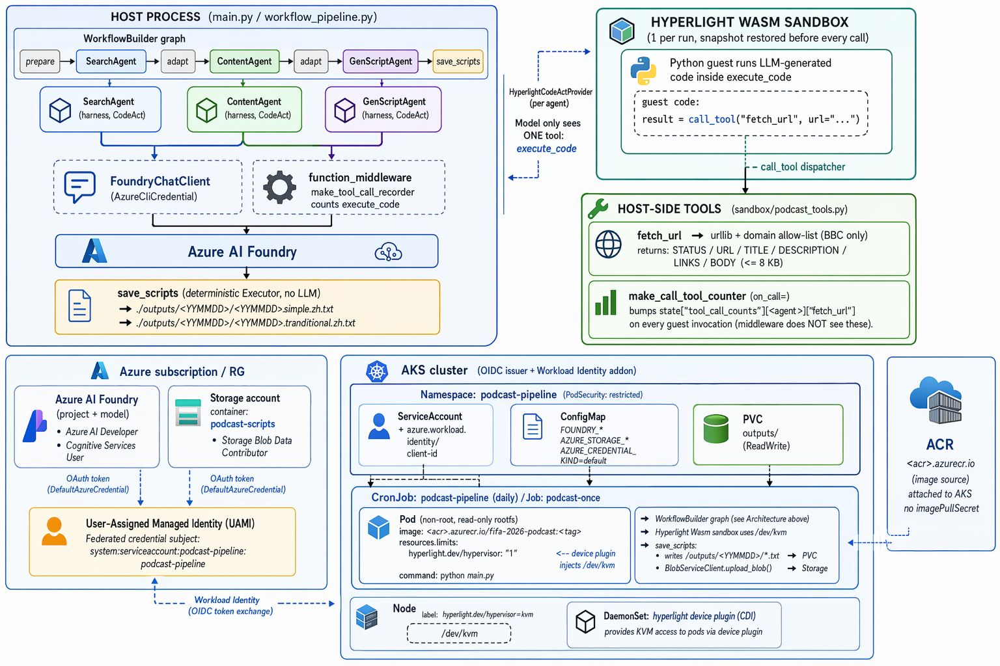

# 《FIFA 2026 世界杯 5 分钟》Podcast Pipeline — Harness Agents on Hyperlight Sandbox



A local, **graph-orchestrated multi-agent workflow** that produces a daily
Mandarin podcast script about the **FIFA World Cup 2026**. The three LLM
agents are built with [Microsoft Agent Framework](https://github.com/microsoft/agent-framework)'s
`create_harness_agent` + `FoundryChatClient`, wired into a `WorkflowBuilder`
graph (see [`03-workflows`](https://github.com/microsoft/agent-framework/tree/main/python/samples/03-workflows)),
and run untrusted code inside a single
[Hyperlight Wasm sandbox](https://github.com/hyperlight-dev/hyperlight-sandbox).

Every agent uses the **CodeAct** pattern from
[`02-agents/context_providers/code_act/code_act.py`](https://github.com/microsoft/agent-framework/blob/main/python/samples/02-agents/context_providers/code_act/code_act.py):
the model only sees one tool — `execute_code` — and any extra capability
(here, only `fetch_url`) is reachable from inside the guest via
`call_tool(...)`.

All three agents' role prompts and the shared sandbox/CodeAct
guardrails live as **file-based Agent Skills** under [`skills/`](skills/),
following the [`02-agents/skills`](https://github.com/microsoft/agent-framework/tree/main/python/samples/02-agents/skills)
sample. The agents themselves carry only a tiny stub instruction; the
harness's built-in `SkillsProvider` advertises the SKILL.md packages
and the model loads them via `load_skill` at runtime.

## Architecture

Two planes run together every episode: an **orchestration plane** on the
host (workflow graph + LLM clients + deterministic save) and an
**execution plane** inside one Hyperlight Wasm sandbox (the only place
LLM-generated code is allowed to run). The single bridge between them is
`call_tool("fetch_url", ...)`.

```
+----------------------------------------------------------------------------+
|  HOST PROCESS  (main.py / workflow_pipeline.py)                            |
|                                                                            |
|  WorkflowBuilder graph                                                     |
|    prepare -> SearchAgent -> adapt -> ContentAgent -> adapt                |
|             -> GenScriptAgent -> save_scripts                              |
|                                                                            |
|  +-------------------+   +-------------------+   +-------------------+     |
|  |   SearchAgent     |   |   ContentAgent    |   |   GenScriptAgent  |     |
|  | (harness, CodeAct)|   | (harness, CodeAct)|   | (harness, CodeAct)|     |
|  +---------+---------+   +---------+---------+   +---------+---------+     |
|            |                       |                       |               |
|            +-----------+-----------+-----------+-----------+               |
|                        |                       |                           |
|                        v                       v                           |
|              FoundryChatClient        function_middleware                  |
|              (AzureCliCredential)     make_tool_call_recorder              |
|                        |                       |                           |
|                        v                       v counts execute_code       |
|                  Azure AI Foundry                                          |
|                                                                            |
|  save_scripts (deterministic Executor, no LLM)                             |
|        -> ./outputs/<YYMMDD>/<YYMMDD>.simple.zh.txt                        |
|        -> ./outputs/<YYMMDD>/<YYMMDD>.tranditional.zh.txt                  |
+--------------------------------+-------------------------------------------+
                                 |
                                 |  HyperlightCodeActProvider (per agent)
                                 |  Model only sees ONE tool: execute_code
                                 v
+----------------------------------------------------------------------------+
|  HYPERLIGHT WASM SANDBOX  (1 per run, snapshot restored before every call) |
|                                                                            |
|  Python guest runs LLM-generated code inside execute_code                  |
|                                                                            |
|         guest code:  result = call_tool("fetch_url", url="...")            |
|                                          |                                 |
+------------------------------------------+---------------------------------+
                                           |
                                           |  call_tool dispatcher
                                           v
+----------------------------------------------------------------------------+
|  HOST-SIDE TOOLS  (sandbox/podcast_tools.py)                               |
|                                                                            |
|   fetch_url  ->  urllib + domain allow-list (BBC only)                    |
|                  returns: STATUS / URL / TITLE / DESCRIPTION /             |
|                           LINKS / BODY  (<= 8 KB)                          |
|                                                                            |
|   make_call_tool_counter (on_call=)                                        |
|     bumps state["tool_call_counts"][<agent>]["fetch_url"] on every guest   |
|     invocation (middleware does NOT see these).                            |
+----------------------------------------------------------------------------+
```

Key invariants the diagram encodes:

- **The model never sees the network.** Its only tool is `execute_code`;
  network access only happens when the guest itself calls
  `call_tool("fetch_url", ...)`.
- **One sandbox per run, snapshot per call.** All three agents share the
  same `HyperlightRuntime`; before every `execute_code` the guest is
  reset to a clean snapshot.
- **Two counter paths.** The middleware sees `execute_code` (model-direct);
  `on_call=` on `make_fetch_url_tool` sees the inner guest-initiated
  `fetch_url`, which Hyperlight dispatches straight to the FunctionTool
  and would otherwise bypass middleware.
- **Deterministic save.** `GenScriptAgent` only emits text; the
  `save_scripts` Executor parses the two fenced blocks and writes the
  files — there is no LLM in the persistence step.

## Cloud-native architecture (AKS)

The local architecture above stays unchanged when running in-cluster — the
same `WorkflowBuilder` graph, the same Hyperlight sandbox, the same
deterministic `save_scripts` executor. What changes is **how identity,
hypervisor access, and durable storage are wired**: the host process is
now a CronJob pod on AKS, the model token comes from a User-Assigned
Managed Identity via Workload Identity, `/dev/kvm` is injected by the
Hyperlight device plugin, and the two `.txt` files land in both a PVC
(in-cluster cache) and Azure Blob Storage (durable, cross-cluster).

```
+----------------------------------------------------------------------------+
|                          Azure subscription / RG                           |
|                                                                            |
|  +----------------------+      +-----------------------+                   |
|  | Azure AI Foundry     |      | Storage account       |                   |
|  | (project + model)    |      |   container:          |                   |
|  | - Azure AI Developer |      |   podcast-scripts     |                   |
|  | - Cognitive Services |      | - Storage Blob Data   |                   |
|  |   User               |      |   Contributor         |                   |
|  +----------+-----------+      +-----------+-----------+                   |
|             ^                              ^                               |
|             | OAuth token                  | OAuth token                   |
|             | (DefaultAzureCredential)     | (DefaultAzureCredential)      |
|             |                              |                               |
|  +----------+------------------------------+-----------+                   |
|  |        User-Assigned Managed Identity (UAMI)        |                   |
|  |  Federated credential subject:                      |                   |
|  |    system:serviceaccount:podcast-pipeline:          |                   |
|  |                          podcast-pipeline           |                   |
|  +----------+------------------------------------------+                   |
|             ^ Workload Identity (OIDC token exchange)                      |
|             |                                                              |
|  +----------+----------------------------------------------------------+   |
|  | AKS cluster  (OIDC issuer + Workload Identity addon)                |   |
|  |                                                                     |   |
|  |  Namespace: podcast-pipeline  (PodSecurity: restricted)             |   |
|  |                                                                     |   |
|  |  +-------------------+   +---------------------+   +-------------+ |   |
|  |  | ServiceAccount    |   | ConfigMap           |   | PVC          | |   |
|  |  | + azure.workload. |   |  FOUNDRY_*          |   | outputs/     | |   |
|  |  |   identity/       |   |  AZURE_STORAGE_*    |   | (ReadWrite)  | |   |
|  |  |   client-id       |   |  AZURE_CREDENTIAL_  |   |              | |   |
|  |  +---------+---------+   |  KIND=default       |   +------+-------+ |   |
|  |            |             +----------+----------+          |         |   |
|  |            |                        |                     |         |   |
|  |            v                        v                     v         |   |
|  |  +------------------------------------------------------------+    |   |
|  |  | CronJob: podcast-pipeline   (daily) / Job: podcast-once    |    |   |
|  |  |                                                            |    |   |
|  |  |  Pod (non-root, read-only rootfs)                          |    |   |
|  |  |   image: <acr>.azurecr.io/fifa-2026-podcast:<tag>          |    |   |
|  |  |   resources.limits:                                        |    |   |
|  |  |     hyperlight.dev/hypervisor: "1"   <-- device plugin     |    |   |
|  |  |                                          injects /dev/kvm |    |   |
|  |  |   command: python main.py                                  |    |   |
|  |  |     -> WorkflowBuilder graph (see Architecture above)      |    |   |
|  |  |     -> Hyperlight Wasm sandbox uses /dev/kvm               |    |   |
|  |  |     -> save_scripts:                                       |    |   |
|  |  |          writes /outputs/<YYMMDD>/*.txt    --> PVC         |    |   |
|  |  |          BlobServiceClient.upload_blob()   --> Storage     |    |   |
|  |  +------------------------------------------------------------+    |   |
|  |                                                                     |   |
|  |  Node:  label hyperlight.dev/hypervisor=kvm                         |   |
|  |         DaemonSet: hyperlight device plugin (CDI)                   |   |
|  |         /dev/kvm                                                    |   |
|  +---------------------------------------------------------------------+   |
|                                                                            |
|  ACR: <acr>.azurecr.io   (image source, attached to AKS, no imagePullSecret)|
+----------------------------------------------------------------------------+
```

What this buys over the local layout:

- **No secrets in the cluster.** The UAMI federates on the SA's OIDC
  subject; `DefaultAzureCredential` picks it up via the Workload Identity
  webhook. No client secrets, no service principal passwords, no
  `az login` inside the pod.
- **Hardware isolation stays.** The pod is unprivileged
  (`runAsNonRoot`, read-only rootfs, dropped caps); only the device
  plugin maps `/dev/kvm` in via CDI when the pod requests
  `hyperlight.dev/hypervisor: "1"`.
- **Durable, cross-cluster output.** `save_scripts` writes the PVC copy
  first (so failures still produce a local artefact) and then best-effort
  uploads to `<container>/<YYMMDD>/`. The CronJob is stateless; the Blob
  account is the source of truth.

End-to-end provisioning + identity + role assignments are documented in
[Infra/README.md](Infra/README.md).

## Workflow graph

The graph is assembled in [workflow_pipeline.py](workflow_pipeline.py) with
`WorkflowBuilder`. The three LLM agents are workflow nodes; small adapter
executors shape data between them; persistence is a deterministic host-side
`Executor` (no LLM in the save step).

```
prepare_search_prompt
        |
        v
   SearchAgent
        |
        v
adapt_search_to_content
        |
        v
   ContentAgent
        |
        v
adapt_content_to_genscript
        |
        v
  GenScriptAgent
        |
        v
   save_scripts  --> yield_output
```

| Node | Kind | Tools visible to model | Responsibility |
|---|---|---|---|
| `prepare_search_prompt` | adapter | — | Build the SearchAgent prompt from the target date. |
| `SearchAgent` | harness agent (CodeAct) | `execute_code` (+ guest `call_tool("fetch_url", ...)`) | Fetch the BBC World Cup listing page, extract article URLs from the `LINKS:` header, verify them, and return the **top 5** stories as JSON. BBC-only. |
| `adapt_search_to_content` | adapter | — | Wrap SearchAgent's JSON into the ContentAgent prompt. |
| `ContentAgent` | harness agent (CodeAct) | `execute_code` (+ guest `call_tool("fetch_url", ...)`) | Build a 5-section podcast outline; run a DeepSearch pass to enrich each section with facts/quotes from the verified URLs. |
| `adapt_content_to_genscript` | adapter | — | Wrap the brief into the GenScriptAgent prompt. |
| `GenScriptAgent` | harness agent (CodeAct) | `execute_code` only (sandbox-only) | Write the on-air script for *《FIFA 2026 世界杯 5 分钟》* hosted by **Kinfey Lo**. Produces both **zh-CN** (mainland Mandarin commentary style) and **zh-TW** (HK Cantonese broadcast style) inside two fenced blocks. Mandatorily runs `execute_code` to assert each script's Han-character count is in 1500–1900. |
| `save_scripts` | deterministic `Executor` | — | Splits the two fenced blocks, normalizes `host : ...` lines, writes `./outputs/<YYMMDD>/<YYMMDD>.simple.zh.txt` + `.tranditional.zh.txt`, and (when `AZURE_STORAGE_ACCOUNT` + `AZURE_STORAGE_CONTAINER` are set) also uploads both files to Azure Blob Storage under `<container>/<YYMMDD>/`. |

> The spelling **`tranditional`** in the filename is intentional — it
> matches the project spec verbatim.

The three LLM agents share **one** Hyperlight Wasm sandbox per workflow run
(via `HyperlightCodeActProvider`). Each `execute_code` call restores a
clean snapshot, so state cannot leak between agents or between turns.

## Tool model

Hyperlight's Python guest can't reach the network on its own (`urllib`
stalls), so the host exposes a single bridge tool, `fetch_url`, that the
guest can invoke through `call_tool("fetch_url", url=...)`. It runs on the
host with `urllib`, restricted to a BBC-only allow-list
(`www.bbc.com`, `bbc.com`), and returns a compact ≤8 KB record:

```
STATUS: 200
URL: https://www.bbc.com/...
TITLE: ...
DESCRIPTION: ...
LINKS:
  - https://www.bbc.com/sport/football/articles/<opaque-id>
  - ...

BODY:
<HTML-stripped article text, capped to fit the 16 KB guest output buffer>
```

The host pre-extracts BBC sport article/video URLs from the raw HTML and
emits them under `LINKS:` so SearchAgent never has to invent slugs — URLs
that aren't in that list don't exist.

`GenScriptAgent` has **no** host bridge; it only sees `execute_code` and
uses it for length verification of the two scripts.

Tool-call counters live in two places, since Hyperlight dispatches inner
`call_tool(...)` directly to the FunctionTool and bypasses the agent's
function middleware:

- `make_tool_call_recorder(...)` (`@function_middleware`) — counts
  `execute_code` calls the model makes directly.
- `make_call_tool_counter(...)` — passed as `on_call=` to
  `make_fetch_url_tool(...)` so guest-initiated `fetch_url` invocations
  are still counted.

## Project layout

```text
.
├── main.py                       # streams the workflow run, prints tool inventory + status
├── workflow_pipeline.py          # WorkflowBuilder graph (agents + adapters + SaveScripts)
├── requirements.txt
├── .env.sample
├── agents/
│   ├── __init__.py
│   ├── common.py                 # build_harness, FoundryChatClient, skill_path(), recorder/counter helpers
│   ├── search_agent.py           # thin stub → loads search-bbc-worldcup + hyperlight-sandbox skills
│   ├── content_agent.py          # thin stub → loads content-deepsearch + hyperlight-sandbox skills
│   ├── genscript_agent.py        # thin stub → loads genscript-podcast + hyperlight-sandbox skills
├── skills/                       # file-based Agent Skills (SKILL.md packages)
│   ├── hyperlight-sandbox/SKILL.md   # shared CodeAct + call_tool("fetch_url", ...) guardrails
│   ├── search-bbc-worldcup/SKILL.md  # BBC-only listing → LINKS → verify workflow + JSON shape
│   ├── content-deepsearch/SKILL.md   # outline + DeepSearch enrichment workflow
│   └── genscript-podcast/SKILL.md    # zh-CN + zh-TW script style + mandatory length check
├── sandbox/
│   ├── __init__.py
│   ├── hyperlight_runtime.py     # HyperlightRuntime + workspace_root setup
│   ├── codeact.py                # build_codeact_provider (HyperlightCodeActProvider wrapper)
│   └── podcast_tools.py          # make_fetch_url_tool (host-side urllib + LINKS extraction)
└── outputs/                      # created on first run
    └── 260603/
        ├── 260603.simple.zh.txt
        └── 260603.tranditional.zh.txt
```

### Agent skills

Each SKILL.md is a self-contained Agent Skill (YAML frontmatter +
Markdown body) that the harness's `SkillsProvider` advertises to the
model. The agent calls `load_skill` to read the body when it actually
needs the workflow — progressive disclosure keeps the per-turn prompt
small.

| Skill | Used by | What it carries |
|---|---|---|
| `hyperlight-sandbox` | all 3 agents | `execute_code` model + `call_tool("fetch_url", ...)` bridge format + BBC allow-list + sandbox guardrails |
| `search-bbc-worldcup` | SearchAgent | source policy, listing → LINKS extraction → per-URL verification, JSON output schema |
| `content-deepsearch` | ContentAgent | 5-section outline + DeepSearch fetch plan, Markdown output shape |
| `genscript-podcast` | GenScriptAgent | *FIFA 2026 世界杯 5 分钟* style guide (zh-CN 詹俊 / zh-TW 伍晃荣), two-fenced-block format, mandatory 1500–1900-character length assertion |

Wiring lives in [agents/common.py](agents/common.py): a small
`skill_path(*names)` helper resolves skill folders under `skills/`, and
`build_harness` builds a `SkillsProvider.from_paths([...])` and forwards
it as `skills_provider=` to `create_harness_agent`.

## Setup

### 1. Python deps

```powershell
conda create -n agentdev python=3.12 -y
conda activate agentdev
pip install -r requirements.txt
```

### 2. Hyperlight Wasm sandbox

The Hyperlight Python SDK + Python guest module are built from source.
Clone the repo and build both:

```powershell
git clone https://github.com/hyperlight-dev/hyperlight-sandbox.git
cd hyperlight-sandbox
just build           # Rust backends + Wasm guests + Python SDK
pip install src/sdk/python
```

On Windows the sandbox uses the Hyper-V backend (Hyper-V must be enabled).
On Linux you need KVM; on Azure/cloud VMs you may need MSHV.

### 3. Environment

Copy `.env.sample` to `.env` and fill in:

```ini
FOUNDRY_PROJECT_ENDPOINT=https://<your>.services.ai.azure.com/api/projects/<name>
FOUNDRY_MODEL=gpt-5.5
HYPERLIGHT_PYTHON_MODULE_PATH=C:\path\to\hyperlight-sandbox\src\wasm_sandbox\guests\python\python-sandbox.aot
PODCAST_OUTPUT_DIR=./outputs

# Optional: also upload generated scripts to Azure Blob Storage.
# Leave blank to skip the upload (local PVC / outputs dir is always written).
AZURE_STORAGE_ACCOUNT=
AZURE_STORAGE_CONTAINER=podcast-scripts
```

### 4. Azure auth

`FoundryChatClient` uses `AzureCliCredential`:

```powershell
az login
```

## Run

```powershell
# Today's episode
python main.py

# A specific date
python main.py --date 2026-06-01

# Override the output root
python main.py --output-dir D:\podcasts
```

## Run on Kubernetes

All deployment artefacts live under [`Infra/`](Infra/) and follow the
upstream pattern from
[hyperlight-dev/hyperlight-on-kubernetes](https://github.com/hyperlight-dev/hyperlight-on-kubernetes):
an unprivileged pod requests `hyperlight.dev/hypervisor: "1"` and the
device plugin injects `/dev/kvm` (or `/dev/mshv`) into it via CDI.

- [Infra/Dockerfile](Infra/Dockerfile) — single-stage image based on
  `python:3.12-slim` that installs `hyperlight-sandbox[wasm,python-guest]`
  from PyPI (the wheel ships the prebuilt `python-sandbox.aot`) and runs
  the app as a non-root user with a read-only root filesystem.
- [Infra/k8s/](Infra/k8s/) — namespace (Pod Security `restricted`),
  Workload Identity ServiceAccount, ConfigMap (Foundry + Blob target),
  PVC, daily CronJob, and a one-shot Job. Wired together by
  [Infra/k8s/kustomization.yaml](Infra/k8s/kustomization.yaml).
- [Infra/scripts/](Infra/scripts/) — `build-and-push` (bash + PowerShell)
  and `deploy.sh`.

When `AZURE_STORAGE_ACCOUNT` + `AZURE_STORAGE_CONTAINER` are set in the
ConfigMap, `save_scripts` also uploads the two `.txt` files to
`https://<account>.blob.core.windows.net/<container>/<YYMMDD>/` using
`DefaultAzureCredential` (Workload Identity → UAMI with
`Storage Blob Data Contributor`). The PVC copy is kept as the in-cluster
cache; the Blob copy is the durable, cross-cluster destination.

See [Infra/README.md](Infra/README.md) for the end-to-end procedure
(prerequisites, identity wiring, deployment, output retrieval).

`main.py`:

1. Initializes `HyperlightRuntime`.
2. Builds the workflow graph via `build_pipeline(runtime, target_date, state)`.
3. Prints the **Agent Tool Inventory** (configured tools per node).
4. Streams `workflow.run(..., stream=True)` events: `executor_invoked` /
   `executor_completed` / `agent_run_update` / tool events / `output`.
5. At the end, prints the **Agent Tool Status** table — green = the tool
   was actually called at least once, red = never called.
6. Calls `os._exit(0)` to skip atexit, because `WasmSandbox`'s Rust drop
   is `!Send` and would otherwise produce noisy "unsendable" / Windows
   tempdir `PermissionError` tracebacks.

## Security model

- All code generated by the LLM runs **inside Hyperlight Wasm**, hardware-
  isolated from the host.
- The model sees exactly one tool — `execute_code`. Networking is exposed
  through a single host bridge, `fetch_url`, restricted to an explicit
  domain allow-list and HTTP GET only.
- The sandbox can only write under the host's `PODCAST_OUTPUT_DIR`; the
  deterministic `save_scripts` executor is the only thing that ever
  touches the filesystem.
- A fresh snapshot is restored before every `execute_code` call, so no
  state, secrets, or globals leak between agents or between turns.

## References

- [microsoft/agent-framework — `02-agents/context_providers/code_act/code_act.py`](https://github.com/microsoft/agent-framework/blob/main/python/samples/02-agents/context_providers/code_act/code_act.py)
- [microsoft/agent-framework — `03-workflows/_start-here/step2_agents_in_a_workflow.py`](https://github.com/microsoft/agent-framework/blob/main/python/samples/03-workflows/_start-here/step2_agents_in_a_workflow.py)
- [microsoft/agent-framework — `03-workflows/control-flow/sequential_executors.py`](https://github.com/microsoft/agent-framework/blob/main/python/samples/03-workflows/control-flow/sequential_executors.py)
- [microsoft/agent-framework — `02-agents/providers/foundry`](https://github.com/microsoft/agent-framework/tree/main/python/samples/02-agents/providers/foundry)
- [microsoft/agent-framework — `02-agents/skills`](https://github.com/microsoft/agent-framework/tree/main/python/samples/02-agents/skills)
- [hyperlight-dev/hyperlight-sandbox](https://github.com/hyperlight-dev/hyperlight-sandbox)
