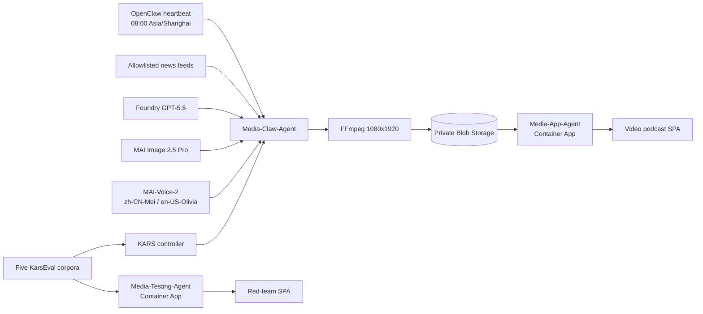

# Architecture

## Runtime flow

Media-Claw runs as a genuine OpenClaw runtime: the custom wrapper prepares the workspace and then uses `exec` to delegate PID 1 to the official KARS OpenClaw entrypoint. The heartbeat checks at or after 08:00 Asia/Shanghai and skips generation when the day's manifest already exists.

## Azure topology

The user-provided resource group receives one AKS Standard cluster, ACR, private Blob containers, Key Vault, Log Analytics, Application Insights, and a Container Apps environment with two apps. Existing user-provided Foundry and Speech endpoints are reused.

Narration is generated through the Azure Speech SDK against the configured `AZURE_SPEECH_ENDPOINT`, using `zh-CN-Mei:MAI-Voice-2` for Chinese and `en-US-Olivia:MAI-Voice-2` for English.

AKS uses Azure CNI Overlay, Azure Network Policy, OIDC, Workload Identity, and a fixed two-node `Standard_D4ds_v7` pool. The KARS controller owns generated sandbox namespaces, deployments, ServiceAccounts, and per-sandbox federated credentials. A shared user-assigned identity has data-plane access to Blob and Key Vault and self-scoped Managed Identity Contributor so KARS can create those federations.

## Agent boundaries

- Media-Claw-Agent owns discovery, story selection, images, scripts, speech, FFmpeg, upload, and the daily manifest.
- Media-App-Agent reads manifests, issues short-lived read-only media URLs, and records likes/stars.
- Media-Testing-Agent normalizes KARS evaluation output and serves report history.

The SPAs are packaged with their owning FastAPI applications. No browser receives account keys.
