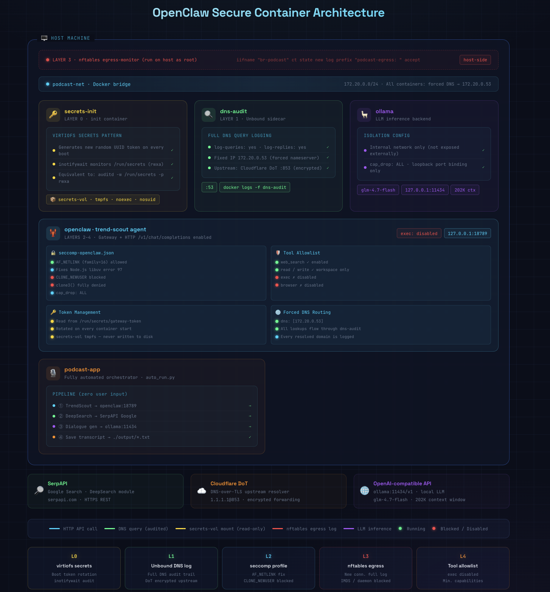

# AI Podcast Generator with OpenClaw — Security-Hardened Edition in 

> OpenClaw TrendScout x SerpAPI DeepSearch x Ollama

---



## Security Architecture (5-Layer Defense)

| Layer | Mechanism | Description |
|-------|-----------|-------------|
| 0 | secrets-init | Token rotation on startup, tmpfs secrets-vol, inotifywait audit |
| 1 | dns-audit | Unbound sidecar, all DNS logged, Cloudflare DoT upstream |
| 2 | seccomp | AF_NETLINK allowed for Node.js, CLONE_NEWUSER blocked, cap_drop ALL |
| 3 | nftables egress | Host-level egress logging, Docker daemon + IMDS blocked |
| 4 | Tool allowlist | exec/browser disabled in openclaw.json |
| 5 | Write control | tmpfs /tmp noexec, workspace volume scoped |

### Container Topology

```
┌─────────────────────────────────────────────────────────────┐
│  Host                                                        │
│  nftables: iifname "br-podcast" ct state new log           │
│            prefix "podcast-egress: " accept                 │
│                                                             │
│  ┌──────────────┐  ┌──────────────┐  ┌──────────────────┐  │
│  │ secrets-init │  │  dns-audit   │  │     openclaw     │  │
│  │ (Layer 0)    │  │  (Layer 1)   │  │     (Layer 2-5)  │  │
│  │              │  │              │  │                  │  │
│  │ regen token  │  │ Unbound      │  │ seccomp          │  │
│  │ on startup   │  │ log-queries  │  │ AF_NETLINK ✓     │  │
│  │ (boot rotate)│  │ =yes         │  │ CLONE_NEWUSER ✗  │  │
│  │              │  │              │  │                  │  │
│  │ inotifywait  │  │ DNS: →       │  │ cap_drop ALL     │  │
│  │ /run/secrets │  │ Cloudflare   │  │ token from file  │  │
│  │ audit log    │  │ DoT          │  │ exec disabled    │  │
│  └──────┬───────┘  └──────┬───────┘  └────────┬─────────┘  │
│         │ secrets-vol     │ :53               │            │
│         └─────────────────┴───────────────────┘            │
│                      podcast-net (172.20.0.0/24)           │
└─────────────────────────────────────────────────────────────┘
```

---

## Security Mechanisms

### Layer 0 — secrets-init

- `secrets-init` container generates a new random token on each startup → writes to tmpfs `secrets-vol`
- `inotifywait` monitors all rwxa events on `/run/secrets`, logs to stdout
- `secrets-vol` uses `tmpfs` driver (`noexec,nosuid`), disappears on restart

### Layer 1 — dns-audit (Unbound DNS query logging)

- `dns-audit` container runs Unbound with fixed IP `172.20.0.53`
- OpenClaw container `dns: [172.20.0.53]` forces all DNS through Unbound
- `log-queries: yes` + `log-replies: yes`, visible in real time via `docker logs -f dns-audit`
- Upstream uses Cloudflare DoT (encrypted, MITM-resistant)

### Layer 2 — seccomp (AF_NETLINK fix + namespace blocking)

> **Note**: Node.js calls `os.networkInterfaces()` at startup via libuv's `uv_interface_addresses`, which needs AF_NETLINK. Without it: "Unknown system error 97".

`security/seccomp-openclaw.json`:
```json
{
  "comment": "socket(): allow all families including AF_NETLINK(16), required by Node.js libuv",
  "names": ["socket"],
  "action": "SCMP_ACT_ALLOW"
},
{
  "comment": "clone(): BLOCK CLONE_NEWUSER(0x10000000) — namespace escape defense",
  "names": ["clone"],
  "action": "SCMP_ACT_ALLOW",
  "args": [{ "index": 0, "value": 268435456, "op": "SCMP_CMP_MASKED_EQ", "valueTwo": 0 }]
},
{
  "comment": "clone3(): fully blocked",
  "names": ["clone3"],
  "action": "SCMP_ACT_ERRNO"
}
```

### Layer 3 — nftables egress logging (host, manual install required)

`security/egress-monitor.sh`:
```bash
sudo bash security/egress-monitor.sh setup
# installs nftables rules with prefix "podcast-egress: "
# blocks access to Docker daemon (2376) and cloud IMDS (169.254.169.254)

sudo bash security/egress-monitor.sh watch
# live monitoring, equivalent to journalctl grep
```

### Layer 4 — Tool allowlist (exec disabled)

```json
// config/openclaw.json
"tools": {
  "web_search": { "enabled": true },
  "read": { "enabled": true, "allowedPaths": ["/home/node/.openclaw/workspace", "/tmp"] },
  "write": { "enabled": true, "allowedPaths": ["/home/node/.openclaw/workspace", "/tmp"] },
  "exec": { "enabled": false },    // shell execution disabled
  "browser": { "enabled": false }  // browser control disabled
}
```

### Layer 5 — write permission control

- `read_only: false` (container not set to read-only)
- `tmpfs: /tmp:rw,noexec,nosuid` (temp directory in-memory, no exec)
- workspace volume mounted separately, write scope restricted at filesystem level

---

## Quick Start

```bash
cp .env.example .env
vim .env  # fill in SERPAPI_KEY

chmod +x setup.sh && ./setup.sh
docker compose run --rm podcast-app
```

---

## Monitoring Commands

```bash
# DNS query audit (all domains resolved by OpenClaw)
docker logs -f dns-audit

# secrets directory access audit
docker logs -f secrets-init

# egress connection log (install first)
sudo bash security/egress-monitor.sh setup
sudo bash security/egress-monitor.sh watch

# view seccomp blocks (dmesg)
dmesg | grep "audit: type=1326"

# OpenClaw Gateway logs
docker logs -f openclaw
```

---

## File Structure

```
ai-podcast-v2/
├── docker-compose.yml        # 5-layer security-hardened service orchestration
├── Dockerfile.app
├── .env.example
├── setup.sh
│
├── security/
│   ├── seccomp-openclaw.json # seccomp: AF_NETLINK fix + CLONE_NEWUSER block
│   ├── unbound.conf          # Unbound DNS query log config
│   ├── secrets-init.sh       # virtiofs boot rotation + auditd inotifywait
│   └── egress-monitor.sh     # nftables microvm-egress equivalent (host)
│
├── config/
│   └── openclaw.json         # tool allowlist + agent config
│
├── auto_run.py               # fully automated orchestration entrypoint
├── trend_scout.py            # OpenClaw TrendScout Agent
├── podcast_generator.py      # LLM dialogue generation (token read from file)
└── deepsearch.py             # SerpAPI DeepSearch
```

